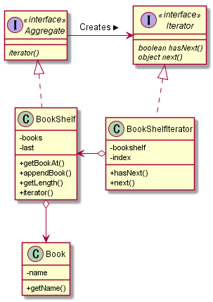

# IteratorPattern
よくJavaで配列の要素をすべて表示するのに、こんな感じで書くことが多い

```java
        for (int i=0; i < array.length; i++) {
            System.out.printf("%d目の配列変数arrayの中身は%d\n", i, array[i]);
        }
```

>この様にarrayの要素全体を最初から順番にスキャン（走査）してる

ここで使われている変数iの働くを抽象化し、一般化したものを

**Iteratorパターン**という

`クラス図`



