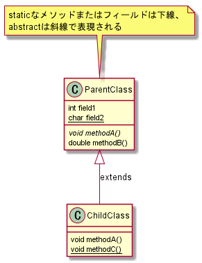

# 前提

- [前提](#前提)
  - [使うもん](#使うもん)
      - [UML](#UML)
      - [デザインパターンを学ぶ前に](#デザインパターンを学ぶ前に)

## 使うもん
- 書籍
  - Java言語で学ぶデザインパターン入門
    - 結城浩

### UML
Unified Modeling Languageの略でシステムの可視化、仕様や設計を文書化するための表現方法

`基本的なクラス図`



`インターフェースの実装`


`集約を表したクラス図`

Basketクラスのfruitsフィールドは、Fruitクラスの配列になっていて、BasketクラスのインスタンスはFruitクラスのインスタンスを複数個もっている。

この様な「持っている」関係を「**集約**(aggregation)」という。インスタンスを持っていれば個数にかかわらず集約の関係にある。
白抜きのひし形戦は集約を表す。


### デザインパターンを学ぶ前に
>デザインパターンはクラスライブラリそのものではない

その通りで、デザインパターンは**概念**である。デザインパターンはプログラム個々の部分がどのように関連して大きな機能を果たすのかを表現したもの。

例
```
白雪姫の話を説明するときに、具体的な役者を説明するのは適切ではない。
ストーリーを説明するのであれば、姫と王子の「関係」を説明するほうが正しい。
特定の役者が演じた「白雪姫」だけが「白雪姫」ではない。
肝心なのは、どういう種類の登場人物がいてそれらがどのような役割を演じるか。
```

例とデザインパターンも同じで、AbstractFactoryPatternがなんだという問いに対し、具体的なプログラム例を答えるのではなく、肝心なのはどのような種類のクラスやインターフェースが出てきて、それらがどのような「関係」にあるかということ。

>しかし、クラスライブラリの中でデザインパターンは使われている

デザインパターンはクラスライブラリそのものじゃない。

GA！

Javaの標準的なAPIのクラスライブラリの中には、デザインパターンが生かされてる。

つまりデザインパターンを理解してればそれらのクラスライブラリの役割を理解することができる。

例
```
java.util.Iterator=>Iteratorパターンが使われてるお
```

>プログラムを完成品としてみないこと