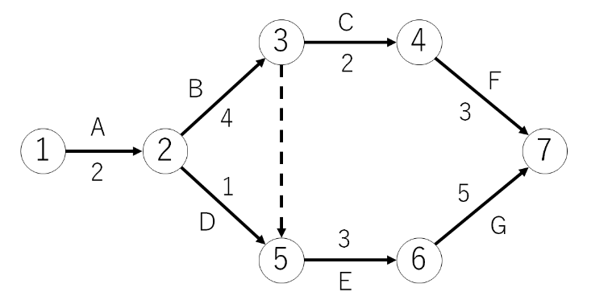
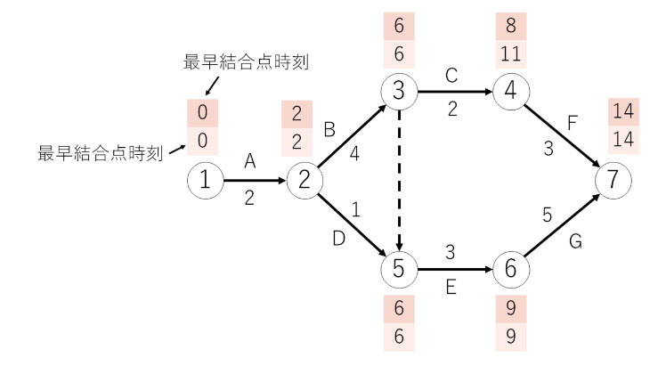
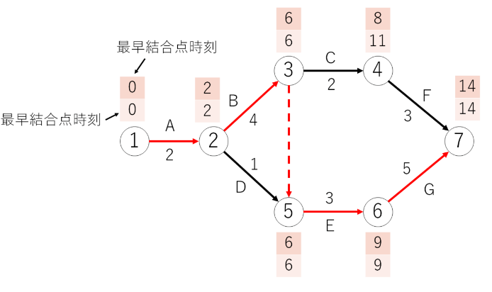

# マネジメント系

## プロジェクトマネジメント

### プロジェクト
- 特定の目標を達成するために専門性の高い人材を集めて編成された組織
- プロジェクトマネージャ
  - プロジェクトの責任者
- プロジェクトメンバ
  - プロジェクトの構成員
- ステークホルダ
  - 利害関係者
  - 従業員や株主、顧客、得意先、地域社会等がステークホルダに当たる

### PMBOK
Project Management Body of Knowledge
- プロジェクト管理に必要な知識を体系化したもの
  - 次の10個の知識エリアと５個のプロセスに分けて体系化している。
    - 知識エリア
      - 統合管理
      - スコープ管理
      - スケジュール管理
      - コスト管理
      - 品質管理
      - 資源管理
      - コミュニケーション管理
      - リスク管理
      - 調達管理
      - ステークホルダ管理
    - プロセス
      - 立ち上げ
      - 計画
      - 実行
      - 監視、コントロール
      - 終結

#### PDCAサイクル
プロジェクトは立ち上げから終結までの間PDCAサイクルで継続的に改善する活動

### プロジェクト統合マネジメント
他の９つの知識エリアを統合的に管理し、調整する分野
プロジェクト統合マネジメントの活動の一つに**構成管理**がある。
- 構成管理
  - プロジェクト統合マネジメント活動の一つ
  - ソースやドキュメントが最新の状態になることを保つ活動
- プロジェクト憲章
  - プロジェクトを正式に認可するために必要な文書

### プロジェクトスコープマネジメント
- プロジェクトの作業範囲(スコープ)を明確にし、プロジェクトが生み出す製品やサービスなどの成果物とそれらを完成するために必要な作業を定義する分野
- 次のWBSが用いられる。
#### WBS
- Work Breakdown Structure
- プロジェクトで行う作業を階層的に分解した図
- 作業分解図と訳される。

### プロジェクトスケールマネジメント
- プロジェクトを決められた期間内に完了させるために、スケジュール管理や日程調整を行う分野

#### ガントチャート
- 作業開始から作業終了までの予定と実績や、作業中の項目を棒状に表した図
- マイルストーン
  - 中間到達点
  - 工程と工程の節目にマイルストーンを設定してクリア目標などを設定する。
- トレンドチャート
  - プロジェクトのコストを意識しながら進捗管理を行うためのツール

### プロジェクトコストマネジメント
- プロジェクトを決められた予算内に完了させるために開発コストを積算して管理する分野
- 次のような見積もり手法が用いられる。
#### ファンクションポイント法
- 帳票数や画面数、ファイル数などからソフトウェアの機能を定量的に把握し、その機能の難易度を数値化して見積もる方法
- その他の見積もり法
  - 類推見積法
    - 開発条件が過去に経験したシステムと類似している場合に過去の実績値をもとにして見積もる
  - プログラムステップ法
    - 開発するプログラムのステップ数をもとに見積もる。LOC(Lines Of Code)法ともいう
  - COCOMO法
    - LOC法を基に開発者のスキルや難易度などの補正係数を掛け合わせて見積もる.COnstructive COst Modelの略
  - 標準タスク法
    - WBSに基づいて、成果物単位や作業単位に見積もり、ボトムアップに積算して見積もる

#### 開発工数
単位には**人月**などがある例えば、10人月の作業とは、10人でやれば1か月、5人なら2ヶ月、1人なら10か月かかる作業のことを意味する。
- TCO
  - Total Cost of Ownership
  - システム導入から運用・維持・管理までを含めた総コスト
  - イニシャルコスト
    - システム導入時に発生する費用
  - ランニングコスト
    - システム導入後に発生する運用保守、維持管理の費用

### その他の知識エリア
- プロジェクト品質マネジメント
  - プロジェクトが生み出す成果物の品質を管理する。
- プロジェクト資源マネジメント
  - プロジェクトに必要な人的資源・物的資源を管理する。
- プロジェクトコミュニケーションマネジメント
  - プロジェクトにおける適切なコミュニケーション手段を選択する
- プロジェクトリスクマネジメント
  - プロジェクトに利害を及ぼす可能性があるリスクを管理する
- プロジェクト調達マネジメント
  - プロジェクトに必要な外部資源の調達や契約を管理する
- プロジェクトステークホルダマネジメント
  - プロジェクトの利害関係者を調整する。

#### フィージビリティスタディ
- 新しい事業やプロジェクトや計画などに対し、その実行可能性を評価するために調査・検証すること

## 工程管理
### アローダイアグラム(Arrow Diagram)
プロジェクトはたくさんの作業で構成されている。作業にはシーケンシャルにしか出来ないものもあればパラレルにできるものもある。
- アローダイアグラム(PERT図)
  - 作業の順序や相互関係をネットワーク上にした図
  - 工程管理の際に用いられる

  - 点線の作業は**ダミー作業**と呼ばれる
    - ダミー作業は工数が0だが、ダミー作業を終えないと次の作業には進めない。
    - 図でいうと、B,Dの作業が完了しないとEの作業を開始できない。
  - 〇が結合点、アルファベットが作業名、その下の数字が所要日数となる。

#### 最早開始日（最早結合点時刻）
- 全ての選考作業が完了し、最も早く後続作業を開始できる時点
- 先行作業の最早開始日に作業日数を加えて求める。
- 複数の先行作業が合流する結合点の最早開始日は最も遅い作業に合わせるのがポイント
- 先行作業の完了を待って、後続作業が開始する関係を**FS関係**（Finish-to-Start）という

#### 最遅開始日（最遅結合点時刻）
- 全ての後続作業の日程が遅れないように、遅くとも先行作業が完了していなくてはならない時点
- 後続作業の最遅開始日から作業日数を引いて求める。
- 複数の後続作業から合流する結合点の最遅開始日は最も早い作業に合わせるのがポイント
- ↑の図の薄ピンクの数値が最遅開始日

#### クリティカルパス
- 最早開始日と最遅開始日が等しい結合点を結んだ経路
- 全ての経路のうち最も所要日数がかかる経路になってる。
- 予定した日数から遅らせてはいけない、遅れるとプロジェクト全体に遅れが生じる作業経路

- 赤いのがクリティカルパス

### スケジュール短縮の手段
- クラッシング
  - 追加で人や資金を投入することでスケジュールを短縮する
- ファストトラッキング
  - 前工程が完了する前に後工程を開始する

## ITサービスマネジメント
### ITサービスマネジメント
- 利用者の視点でITサービスを効果的に提供できるように管理すること
- ITIL
  - Information Technology Infrastructure Library
  - ITサービスマネジメントに関するベストプラクティスを作成、体系化したもの。
  - ITサービスマネジメントにおけるデファクトスタンダードとなっている。

#### サービスデスク
- ITサービスを利用する利用者とITサービスを提供する事業者との間の単一窓口
- 次のような種類がある。
  - 中央サービスデスク
    - サービスデスクを1か所に配置して効率化を図る
  - ローカルサービスデスク
    - サービスデスクを利用者の近くに配置して利用者との正確な意思疎通や多言語対応を図る
  - バーチャルサービスデスク
    - サービスデスクの場所を複数に分散させ、通信技術を用いて論理的に窓口の一元化を図る

#### インシデント管理
- 迅速に正常なITサービスへ復旧させることを優先するプロセス
- 利用者への悪影響を最小限に抑える。
- インシデント
  - 利用者に対する正常なITサービスの妨げになる事象
- エスカレーション
  - 専門知識や経験のある問題管理のスタッフに解決をゆだねること

#### サービス要求
- サービスデスクで、インデント連絡以外のやり方についての連絡を受けることがある。これらをサービス要求と呼ぶ。
- サービス要求に応えることを要求実現といい、マニュアルに沿って行われる。
- インシデント管理とサービス要求をまとめて、インシデント管理およびサービス要求管理　と呼ぶ

#### 問題管理
- インシデントの根本的な原因を突き止め、再発を防止して恒久的な解決策を提供するプロセス

#### 変更管理
- 変更に伴う影響を検証・評価を行ったうえで承認または却下の決定を行うプロセス

#### リリース管理
- 変更管理で承認された変更を適切な時期に本番環境に適用するプロセス

#### 構成管理
- 構成管理データベースを使用してITサービスの提供に必要なIT資産を常に正しく把握し、最新状態に保つプロセス

#### サービスレベル管理
- 利用者が要求するサービスレベルを満たしているかを評価するプロセス。
- サービスレベルアグリーメント
  - SLA(Service Level Agreement)
  - 事前に利用者とITサービスを提供する事業者との間でサービス品質に対するサービスレベルについて締結した合意書
- SLM:サービスマネジメント
  - PDCAサイクルを実施し、継続的にITサービスの維持向上を図るマネジメント活動

#### 可用性管理
- ITサービスを構成する個々の機能の維持管理を行うプロセス

#### キャパシティ管理
- ITサービスに必要なネットワークやシステムなどの容量・能力を管理し、最適なコストで情報システムの安定を実現するプロセス

### ファシリティマネジメント
- 建物やIT関連設備などの保有・運用・維持管理などについて、常に監視し改善することで最適化を図る経営活動
- サージ保護デバイス
  - SPD:Surge Protective Device
  - 落雷によって発生する過電圧を防ぐ
  - このデバイスを介して通信ケーブルやコンピュータを接続する
- UPS
  - Uninterruptible Power Supply
  - 電源の瞬断や停電時にシステムを終了させるのに必要な時間だけ電源供給することを目的とした装置

## システム監査
### システム監査
- システム監査人が監視対象から独立した立場で行う情報システムの監査
- 目的は情報システムに係るリスクに適切に対処しているかどうかを独立かつ専門的な立場のシステム監査人が点検、評価、検証することでITガバナンスの実現に寄与すること。

### システム監査の手順
システム監査は
- システム監査計画の作成
- システム監査の実施
- システム監査の報告
- フォローアップ
の順に実施する。
#### システム監査計画の作成
- システム監査の目的を有効かつ効果的に達成するために監査手続の内容や時期、範囲などについて適切な監査計画を作成する。

#### システム監査の実施
計画に基づき、予備調査、本調査、評価・結論の順で実施する。
- 予備調査
  - 本調査に先立ってアンケート調査などを行い、監査対象業務の実態を把握する
- 本調査
  - インタビューや現地調査などを行い、監査対象の実態を詳細に調査し、監査証拠を入手する
  - 監査証拠
    - システム監査人が被監査部門から得た情報を裏付けるための文書や記録
- 評価・結論
  - 入手した監査証拠に基づいて指摘事項などの監査意見を監査調書にまとめる
  - 監査調書
    - システム監査人が行った監査業務の実施記録で、関西圏の根拠となるもの

#### システム監査の報告
- システム監査人が監査報告書を作成し、遅延なく監査依頼者に報告する。

#### フォローアップ
- 監査人は改善提案に対する監査対象部門の改善状況をモニタリングする。
- 監査対象部門に対して改善命令を出すのは監査依頼者

### 内部統制
- 企業自らが業務を適正に遂行するために経営者の責任で体制を構築して運用する仕組み
- 役割分担や権限を明確にすることが必要（職務分掌）
- コーポレートガバナンス
  - 株主や監査役により企業経営そのものを監督・監視する仕組み
  - 内部統制もコーポレートガバナンスに含めて考える場合もある。