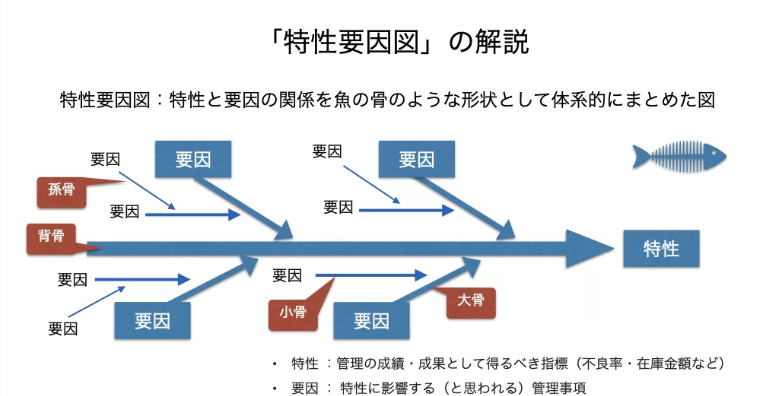
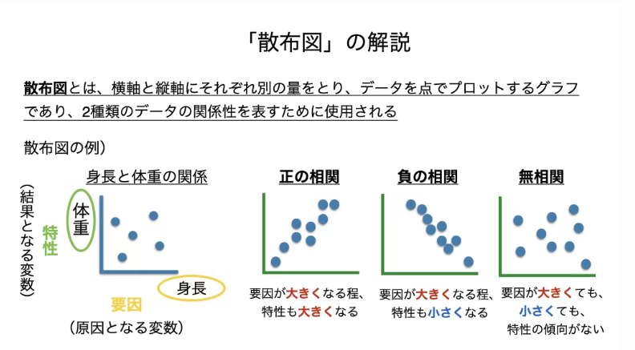
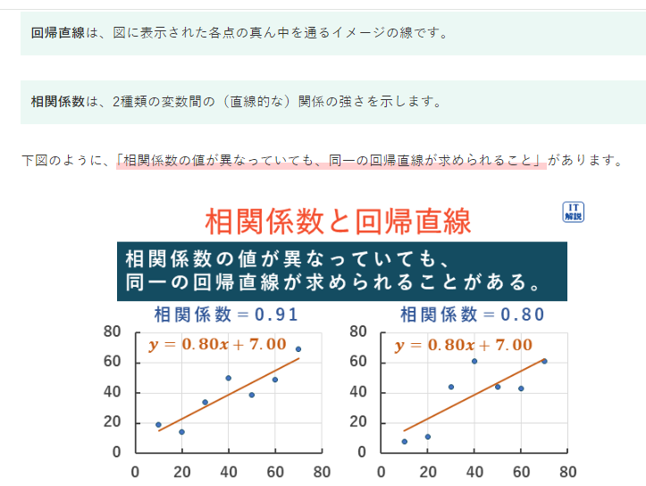
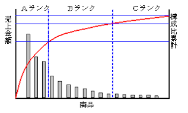
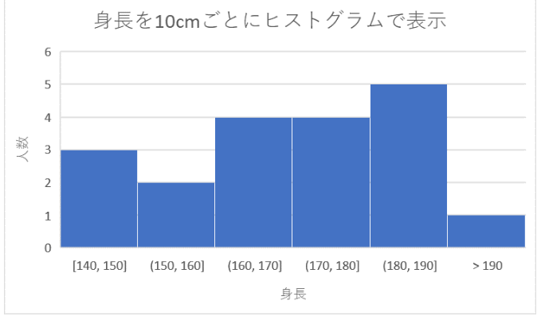
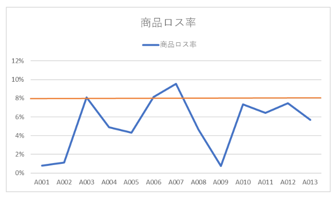
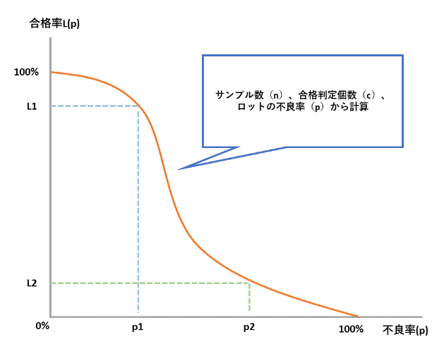

# ストラテジ系
- [ストラテジ系](#ストラテジ系)
  - [ソリューションビジネスとシステム活用促進](#ソリューションビジネスとシステム活用促進)
    - [ソリューションビジネス](#ソリューションビジネス)
    - [ハウジングサービスとホスティングサービス](#ハウジングサービスとホスティングサービス)
      - [ハウジングサービス](#ハウジングサービス)
      - [ホスティングサービス](#ホスティングサービス)
    - [クラウドコンピューティング](#クラウドコンピューティング)
    - [SOA](#soa)
    - [SI](#si)
    - [システム活用促進](#システム活用促進)
      - [デジタルディバイド](#デジタルディバイド)
  - [経営組織と経営・マーケティング戦略](#経営組織と経営マーケティング戦略)
    - [経営組織](#経営組織)
    - [経営戦略](#経営戦略)
    - [全社戦略](#全社戦略)
      - [コアコンピタンス](#コアコンピタンス)
      - [ベンチマーキング](#ベンチマーキング)
      - [RPM](#rpm)
      - [M\&A](#ma)
      - [アライアンス](#アライアンス)
      - [アウトソーシング](#アウトソーシング)
    - [事業戦略](#事業戦略)
      - [SWOT分析](#swot分析)
      - [バリューチェーン分析](#バリューチェーン分析)
      - [成長マトリクス](#成長マトリクス)
    - [マーケティング戦略](#マーケティング戦略)
      - [プロダクトライフサイクル](#プロダクトライフサイクル)
      - [STP分析](#stp分析)
      - [コトラーの競争戦略](#コトラーの競争戦略)
      - [マーケティングミックス](#マーケティングミックス)
      - [コストプラス価格決定法](#コストプラス価格決定法)
      - [イノベータ理論](#イノベータ理論)
  - [業績評価と経営管理システム](#業績評価と経営管理システム)
    - [業績評価手法](#業績評価手法)
      - [BSC](#bsc)
    - [経営管理システム](#経営管理システム)
      - [CRM](#crm)
      - [SCM](#scm)
      - [ERP](#erp)
      - [ナレッジマネジメント](#ナレッジマネジメント)
  - [技術開発戦略](#技術開発戦略)
    - [技術開発戦略](#技術開発戦略-1)
      - [MOT](#mot)
      - [イノベーション](#イノベーション)
      - [APIエコノミー](#apiエコノミー)
      - [オープンイノベーション](#オープンイノベーション)
      - [ハッカソン](#ハッカソン)
      - [魔の川、死の谷、ダーウィンの海](#魔の川死の谷ダーウィンの海)
      - [技術のSカーブ](#技術のsカーブ)
      - [デザイン思考](#デザイン思考)
      - [技術ロードマップ](#技術ロードマップ)
      - [デルファイ法](#デルファイ法)
  - [ビジネスインダストリ](#ビジネスインダストリ)
    - [e-ビジネス](#e-ビジネス)
      - [ec](#ec)
      - [EDI](#edi)
      - [暗号資産](#暗号資産)
    - [Webによる販売促進](#webによる販売促進)
      - [ロングテール](#ロングテール)
      - [オムニチャネル](#オムニチャネル)
    - [行政システム](#行政システム)
    - [エンジニアリングシステム](#エンジニアリングシステム)
      - [JIT](#jit)
      - [MRP](#mrp)
      - [セル生産方式](#セル生産方式)
      - [CAD](#cad)
    - [民生機器・産業機器](#民生機器産業機器)
      - [組込みシステム](#組込みシステム)
      - [IoT](#iot)
      - [エッジコンピューティング](#エッジコンピューティング)
  - [品質管理](#品質管理)
    - [品質管理手法](#品質管理手法)
      - [特性要因図](#特性要因図)
      - [散布図](#散布図)
      - [パレート図](#パレート図)
      - [ヒストグラム](#ヒストグラム)
      - [管理図](#管理図)
      - [OC曲線](#oc曲線)
      - [PDPC法](#pdpc法)

## ソリューションビジネスとシステム活用促進

### ソリューションビジネス
企業が抱えている経営課題や業務上の悩みの解決を目的としたサービス提供事業者のサービス
- オンプレミス
  - 自社の施設内に、自社が保有する情報システムを設置して運用すること

### ハウジングサービスとホスティングサービス
サービス提供事業者画所有する施設やサーバなどを貸し出すサービスがある。その施設には高速回線や地震対策、セキュリティ対策などが施されており、利用する側にとっては運用の手間とコストを削減できるメリットがある。

#### ハウジングサービス
- サービス提供事業者がサーバを設置する施設を貸し出すサービス

#### ホスティングサービス
- サービス提供事業者がサーバを貸し出すサービス

### クラウドコンピューティング
- インターネット上のハードウェアやソフトウェアなどを物理的にどこにあるのかを意識することなく、自社から利用する形態

- クラウドサービス
  - サーバやOSソフトウェアなどを所有して提供するサービス
  - IaaS,PaaS,Saasの３種がある

  - さらにDaaSがある。
    - サービス提供事業者がシンクライアントシステムをネットワーク経由で提供するサービス
  - ASP
    - Application Service Provider
    - 業務アプリをネットワーク経由で提供する事業者です。
  - パブリッククラウド
    - 不特定多数の利用者に提供する
  - プライベートクラウド
    - 特定の企業や個人だけに提供

### SOA
Service Oriented Architecture
- サービス指向アーキテクチャ
- 業務プロセスの機能をサービスとして部品化し、そのサービスを組み合わせることによって、情報システム全体を構築していく考え方

### SI
- システムインテグレーション
- 情報システムの企画から開発・運用・保守までの業務を請け負うサービス

### システム活用促進
- 情報リテラシー
  - PCを利用して情報の整理や蓄積、分析を行ったり、インターネットなどを使って、情報を収集・発信したりする情報を取り扱う能力

#### デジタルディバイド
- PCやインターネットなどのITを利用する能力や機械の違いによって生じる経済的・社会的な格差
- RPA
  - 人がPC上で行う定形的な操作をロボットと呼ばれるソフトウェアにより自動化・効率化すること

## 経営組織と経営・マーケティング戦略

### 経営組織
経営組織の代表的な形態として、次のようなものがある。
- 職能別組織
  - 生産、販売、人事、財務などの仕事の性質によって部門を編成した組織
- 事業部制組織
  - 社内を製品、顧客、地域などの事業ごとに分割し、編成した組織。編成された組織単位に自己完結的な経営活動が展開できる。
- マトリックス組織
  - 構成員が、事故の専門とする職能部門と特定の事業を遂行する部門の両方に所属する組織。
- プロジェクト組織
  - 特定の問題を解決するために、一定の期間に限って結成される組織。問題が解決されると解散する。

### 経営戦略
経営戦略は、企業全体を対象とした全社戦略、個別の事業を対象とした事業戦略、営業、開発、生産、人事、などの部署を対象とした機能別戦略の視点から策定されます。

### 全社戦略
全社戦略は、企業全体の視点から進むべき方向性を示したものです。自社がどの事業領域を核とするのかを示し、経営資源であるヒトモノカネ情報を集中させていきます。自社の経営資源だけでは不十分な場合は、他社の経営資源で保管していくことも考える

#### コアコンピタンス
- 競合他社がまねのできない独自のノウハウや技術などに経営資源を集中し、競争優位を確立する手法
- コアには、核　コンピタンスには能力という意味がある。

#### ベンチマーキング
- 最強の競合他社、または先進企業と比較して、製品やサービス、オペレーションなどを定性的・定量的に把握する手法
- 優れた業績を上げている企業との比較分析から、自社の経営革新を行います。

#### RPM
- Product Portfolio Management
- 事業や製品を花型、負け犬、金の生る木、問題児の四つのカテゴリに分類し、経営資源の最適配分を意思決定する手法

#### M&A
- Mergers and Acquisitions
- 起業の合併・買収

#### アライアンス
- 企業同士の連携
- 他社と競合することなく、自車で不足している経営資源を他社との連携によって保管します。

#### アウトソーシング
情報システムのコストを削減するために、情報システムの開発や運用・保守に関わる全部または一部の機能を外部の専門企業に委託する携帯
- オフショアアウトソーシング
  - 海外の安い人に外部委託すること
- BPO
  - Business Process Outsourcing
  - 自社の業務を含めて外部企業に委託すること

### 事業戦略
事業ごとに進むべき方向性を示したもの

#### SWOT分析
- 起業の経営環境を内部環境である強みと弱み、外部環境である機会と脅威の4つのカテゴリに分類し分析する手法

#### バリューチェーン分析
- 起業の事業活動を機能ごとに主活動と支援活動に分け、企業が顧客に提供する製品やサービスの利益などの付加価値が、どの活動で生み出されているかを分析する手法

#### 成長マトリクス
- 製品と市場の２軸に、それぞれ新規と既存の観点から事業を市場浸透、市場開拓、製品開発、多角化の４つのタイプに分類し、事業の方向性を分析する手法

### マーケティング戦略
- 顧客が自社の製品やサービスに満足してもらうことで、継続的に売れる仕組みを作る一連の活動
  - 顧客満足度 が重要な要素となる
    - CS(Customer Satisfaction)

#### プロダクトライフサイクル
- 製品を、導入期、成長期、成熟期、衰退期の４つの段階に分類し、企業にとって最適な戦略を分析する手法

- PLM
  - Product Lifecycle Management
  - 企画や発売から廃棄までの一連のサイクルを通じて、製品の情報を一元管理し、商品力向上やコスト低減を図る取り組み

#### STP分析
- STP分析
  - 次の３つの観点で分析すること
  - セグメンテーション
  - ターゲティング
  - ポジショニング

#### コトラーの競争戦略
- マーケットシェアの観点からリーダ、チャレンジャ、フォロワ、ニッチャの４つに分類し、競争上の地位に応じた戦略をとる手法

#### マーケティングミックス
- 製品戦略、価格戦略、チャネル戦略、プロモーション戦略などを適切に組み合わせて、自社製品を効果的に販売していく手法
  - 売り手から見た要素は４P
  - 書いてから見た要素は４C

#### コストプラス価格決定法
- 製造原価、または仕入れ原価に一定のマージンを乗せて価格を決定する手法
- 競争指向型
  - 競争相手の価格を反映する
- ターゲットリターン型
  - 目標とするROIを実現できる価格に設定する
- 需要指向型
  - 一番売れそうな価格に設定する。

#### イノベータ理論
新製品をすぐ購入する人もいれば、あまり関心のない人もいる。
イノベータ理論では消費者を新製品への関心が高い順に五つに分類している。

アーリーアダプタとアーリーマジョリティの間には重要視するポイントの違いによる溝（キャズム）があるといわれている。

## 業績評価と経営管理システム

### 業績評価手法
#### BSC
- Balance Score Card
- バランススコアカード
  - 起業のビジョンや戦略を実現するために、財務、学習と成長、顧客、業務プロセスの4つの視点から具体的に目標を設定して業績を評価する手法

BSCでは四つの視点において、次のKGI、KPI, CSFを設定し、モニタリングを繰り返して継続的に改善して行きます。
- KGI
  - Key Goal Indicator
  - 目指すべき最終的な目標となる数値。「重要目標達成指標」と訳される
- CSF
  - Critical Success Factor
  - 最終目標を達成するために必要不可欠となる要因。「重要成功要因」と訳される。
- KPI
  - Key Perfomance Indicator
  - KGIを細分化した中間的な目標となる数値。「重要業績評価指標」と訳される。訪問数。客単価など

### 経営管理システム
経営管理システムは、今まで個人別や部署別など、ばらばらに管理していた情報を１か所に集約し、全社的、さらには企業間で情報を共有することで効率的な経営の実現を支援するシステム
#### CRM
- Customer Relationship Management
- 個別の顧客に関する情報や対応履歴などを一元管理し共有することで、長期的な視点から顧客との良好な関係を築き、収益の拡大を図る手法
  - 顧客関係管理と訳される
- 顧客生涯価値
  - 顧客満足度や一人の顧客が企業にもたらす価値

- SFA
  - Sales Force Automation
  - 個人が持つ営業に関する知識やノウハウなどを一元管理し共有することで、効率的、効果的に営業活動を支援する手法
  - コンタクト管理
    - SFAの基本的な機能の一つ
    - 顧客訪問日、営業結果などの履歴を管理し、見込み客や既存客に対して効果的な営業活動を行う。SFAはCRMの一環として行われる

#### SCM
- Supply Chain Management
- サプライチェーン
  - 部品調達、生産、物流、販売までの一連のプロセス
- サプライチェーンの情報を一元管理し共有することで業務プロセスの全体最適化を図る手法
- リードタイム(商品受注から納品までの期間)の短縮や在庫コストや流通コストの削減が目的

- 3PL
  - サードパーティロジスティクス
  - 起業の物流機能のすべて、または一部を外部の企業に委託すること

#### ERP
- Enterprise Resource Planning
- 生産、流通、販売、財務、経理などの企業の基幹業務の情報を一元管理し共有することで、企業の経営資源の最適化を図る手法

#### ナレッジマネジメント
社員個人がビジネス活動から得た客観的な知識や経験、ノウハウなどを一元管理し共有することで、全体の問題解決力を高める経営を行う手法

## 技術開発戦略
### 技術開発戦略
技術開発戦略は企業を持続的に発展させていくために、技術開発への投資也イノベーションの促進を図り、技術と市場のニーズを結びつける戦略
#### MOT
- Management of Technology
- 高度な技術を核とする技術開発に投資し、イノベーションを創出することで、技術革新を事業に結び付けていく経営
- 技術経営と訳される
#### イノベーション
- 今までにない、画期的な新しいものを作り出すこと
#### APIエコノミー
- 企業同士がAPIを使ってサービスを連携させることで生まれる新しい経済圏
#### オープンイノベーション
企業内部にとどまらず、他企業や他業種、大学、地方自治体、官公庁などと協力して、互いの専門知識を生かしてイノベーションを起こそうという考え
#### ハッカソン
開発者やデザイナーなどが集まってチームを組み、数時間也数日間の日程で与えられた課題にチャレンジするイベント
#### 魔の川、死の谷、ダーウィンの海
- 魔の川
  - 基礎研究が製品開発に結びつかないこと
- 死の谷
  - 製品開発が事業に結びつかない事
- ダーウィンの海
  - 事業化ができても市場に浸透できないこと
#### 技術のSカーブ
- 技術の進歩の過程を示した曲線
- 最初は緩やかに進歩するが、やがて急激に進歩し、その後穏やかに停滞していく
#### デザイン思考
- 利用者も気づかないような潜在的なニーズを掘り起こし、イノベーションを生み出そうとする考え方
#### 技術ロードマップ
- 将来の技術動向を予測して進展の道筋を時間軸上に表したもの
#### デルファイ法
- 複数の専門家からの意見を収集、収集した意見を集約、集約された意見をフィードバック　というプロセスを繰り返すことで意見を収束させていく手法

## ビジネスインダストリ
### e-ビジネス
e-ビジネスはインターネット技術を活用したビジネスの事

#### ec
- Electronic Commerce
- インターネット技術を活用した消費者向け也企業間などの商取引
- 電子商取引と訳される
- 取引形態には次のようなものがある
  - CtoC
    - Consumer to Consumer：個人間取引
  - BtoC
    - Business to Consumer :企業対個人取引
  - BtoB
    - Business to Business:企業間取引
  - BtoE
    - Business to Employee:企業対従業員間取引
  - GtoC
    - Covernment to Citizen:政府対個人間取引
  - GtoB
    - Government to Business:政府対企業間取引
  - GtoG
    - Government to Government:政府間取引

#### EDI
- Electronic Data Interchange
- ネットワークを介して、商取引のためのデータをコンピュータ間で交換すること
- 電子データ交換と訳される。
- 取引の際には次のような当事者間で必要となる規約がある。
  - 情報伝達規約
    - 接続方法・伝送手順などを定めたもの
  - 情報表現規約
    - データフォーマットなどを定めたもの
  - 情報運用規約
    - システムの運用時間・障害対策などを定めたもの
  - 情報基本規約
    - 支払時期・支払い方法などを定めたもの

#### 暗号資産
暗号資産（仮想通過）は電子データでやりとりされる財産的価値
- ブロックチェーン
  - ハッシュ関数を利用して作成する取引の履歴
  - この履歴を分散して持ち合うことで、改ざんなどの不正を防ぐ仕組み
- マイニング
  - ブロックチェーンを作成する際の複雑な計算作業に協力し、その報酬として新規に発行された仮想通過を得ること

### Webによる販売促進
- コンバージョン率
  - Webサイトへのアクセス件数のうち最終的に商品やサービスなどの購入に至った件数
  - コンバージョン率を上げるためには、集客、接客が重要
  - 以下のような仕組みが使われている。

| 名前                  | 説明                                                                                                                      |
| --------------------- | ------------------------------------------------------------------------------------------------------------------------- |
| SEO                   | Search Engine Optimization 検索エンジン最適化。Googleなどの検索サイトで上位に表示させる様な工夫や技術                     |
| リスティング広告      | 検索誘導型広告。ある用語を検索したときにその用語と関連した商品の広告を同じ画面に表示させる                                |
| アフィリエイト        | 成果報酬型広告。個人のWebサイトなどに企業の広告や企業サイトへのリンクを掲載し、誘導実績の利用者に伝搬させる               |
| SNS                   | Social Networking Service Webサイト上で社会適菜つながりを促進するサービス。利用者が発信する情報を多数の利用者に伝播させる |
| CGM                   | Consumer Generated Media 消費者が情報発信した内容を基に生成されていくメディア。口コミサイト・QAサイト動画投稿サイトなど   |
| eマーッケットプレイス | インターネット上に設けられた市場を通じて、多くの売り手と買い手が出合い、中間流通業者を介さず、直接取引をする。 |

#### ロングテール
- ECサイトなどで、余り売れない商品群を売り続けることによってその利益が無視できないくらい大きなものになっているという現象
#### オムニチャネル
- 実店舗での販売やカタログ通販、ネット通販など複数の販売チャネルを持ちそれらを統合して、どの手段でも不便なく購入できるようにすること。
- 類似の考え方として、**O to O**(Online to Offline)がある
  - Webサイトを見た顧客を仮想店舗から実店舗に、また逆に実店舗から仮想店舗に誘導すること

### 行政システム
- マイナンバー制度
  - 行政を効率化し、国民の利便性を高める為、公平、公正な社会を実現する社会基盤
- マイナンバーカード
  ICチップによる公的個人認証機能がある
  - 著名用電子証明書
    - 個人情報が含まれる
  - 利用者証明用電子証明書
    - 個人情報が含まれない
- Maas
  - Mobility as a Service
  - 様々な交通手段をITにより一つのサービスとして統合すること

### エンジニアリングシステム
エンジニアリングシステムは生産工程において生産性を上げる考え方や自動化を図るシステム

#### JIT
- ジャストインタイム
  - 必要なものを必要な時に必要な量だけを生産する方式
  - かんばんと呼ばれる作業指示書を使うことがあり、それは**かんばん方式**と呼ばれている。この方式には製造業以外にもてきようできるよう**リーン生産方式**として一般化されている。

#### MRP
- Materials Requirements Planning
- 製品を生産するために必要となる部品や資材の量を計算し、生産計画に反映させる資材管理手法

#### セル生産方式
- 部品の組立から完成検査までの全工程を一人または数人で作業する生産方式
#### CAD
- Computer Aided Design
- コンピュータを使って設計作業を支援すること

### 民生機器・産業機器
#### 組込みシステム
- 組込みシステムは特定の機能を実現するために専用化されたハードウェアと、それを制御するSoftwareから構成されるシステム

#### IoT
身の回りのあらゆるものがインターネットにつながる事
実際の応用事例として次のよう伍が出題されている。
- M2M
  - Machine to Machine 機会同士が直接通信し人が介在せずに高度な処理を実現する。
- HEMS
  - Home Energy Management System
  - 家庭内の太陽光発電装置や家電、センサなどをネットワーク化して、エネルギーの可視化と消費の最適制御を行う
- スマートメータ
  - 双方向の通信機能を備えた電力量計。遠隔地からの検診や開閉が可能な他、電力消費量を可視化できる。
- デジタルサイネージ
  - ディスプレイに映像、文字などの情報を表示する電子看板。リアルタイム情報や動画も表示できる。

#### エッジコンピューティング
- IoTデバイスやその近くに設置したエッジサーバに分散してデータ処理を行う仕組み等で、分散してネットワーク負荷の低減など

## 品質管理

### 品質管理手法
製造部門を中心に品質を管理するために、データを収集・数値化して定量的または定性的にデータを分析する。
次のような図解を用いて整理する。

#### 特性要因図
- 特性と用死因の関連を魚の骨のような形態に整理して体系的にまとめた図。
- 特性に対してどのような要因が関連しているかを把握する。
- フィッシュボーン図とも呼ばれている。

#### 散布図
- X軸とY軸の座標上をプロットした点のばらつき具合を表した図
- 二つの特性間の相関関係を把握する。
- 相関関係には正の相関、負の相関、相関なしがある。

散布図にプロットされた個々の点の値から次のものが求められる。
- 回帰直線
  - 全体の大まかな傾向を表す直線
  - 個々の点からの誤差が最も少なくなる様に最小2乗法を用いて求める。
- 相関係数
  - 二つの特性間に直線的な関係があるかを示す値
  - 1に近い程正の相関が大きく、0に近いほど相関は少なくなる。 ー１に近くなると、負の相関が大きくなる。

#### パレート図
- データをいくつかの項目に分類し、横軸方向に大きさの順に棒グラフとして並べ、累積値を折れ線グラフで表した図
- ABC分析
  - ある項目の件数を降順に並べ、全体に対する比率によってクラス分けを行い、重点項目を把握する。

#### ヒストグラム
収集したデータをいくつかの区間に分け、各区間に属するデータの個数を棒グラフで表した図。品質のばらつきを把握する。

#### 管理図
時系列データのばらつきを折れ線グラフで表した図。管理限界線を利用して品質不良や工程の異常がないかを把握する。

> まとめ
- 特性要因図
  - 特性と要因の関連を見る
- 散布図
  - 2項目間の相関関係をみる
- パレート図
  - 降順の棒グラフと累積の折れ線グラフで重点項目を見る
- ヒストグラム
  - 区間と出現度数でデータの分布やばらつきをみる
- 管理図
  - 管理限界線で以上の有無を見る

#### OC曲線
- 抜き取り検査を行う際に、ロットの不良率と検査合格率の関係を表した図。
- OC:Oprating Characteristic
- 不良率と合格率の兼ね合いを見ながらどこまでの不良率なら出荷するか決定する。

#### PDPC法
- 事前に考えられる様々な結果を予測し、プロセスの進行をできるだけ望ましい方法に導く手法
- Process Decision Program Chart
- 試行錯誤を避けられない状況における最適解の立案に役立ちます。
