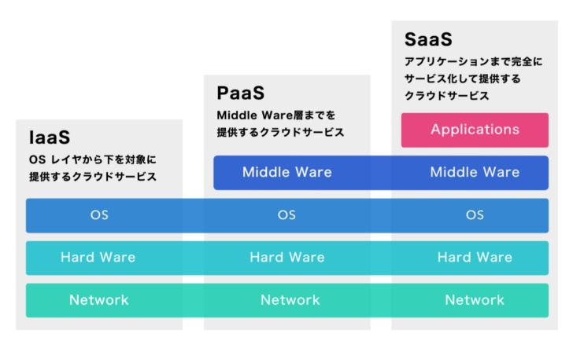
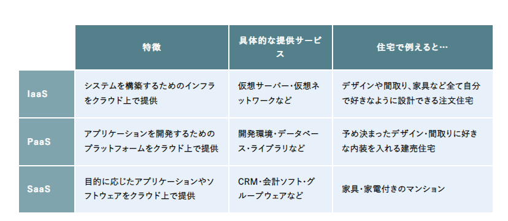
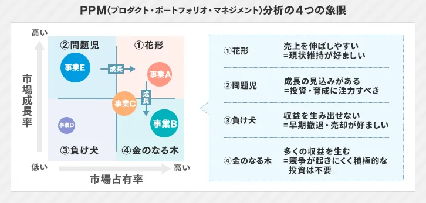
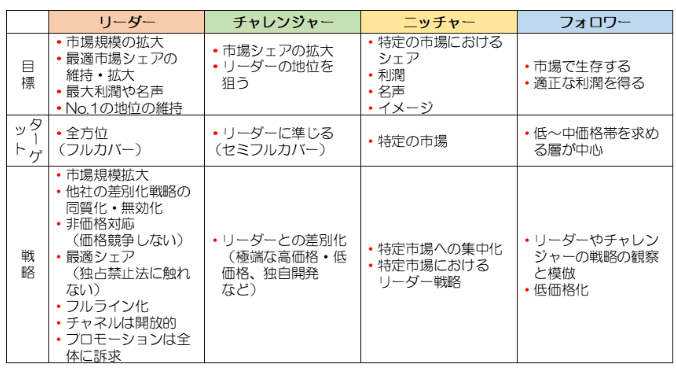
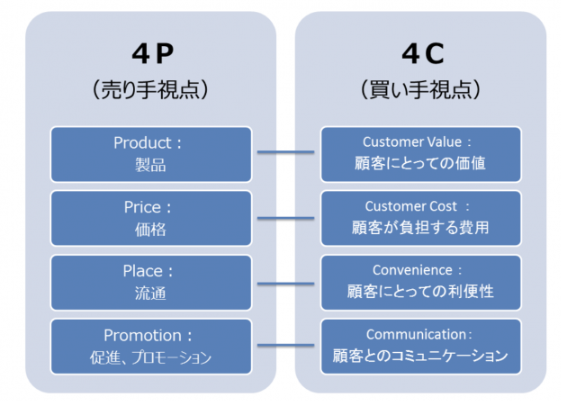
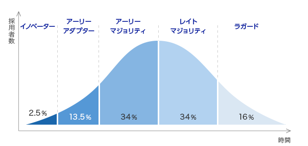
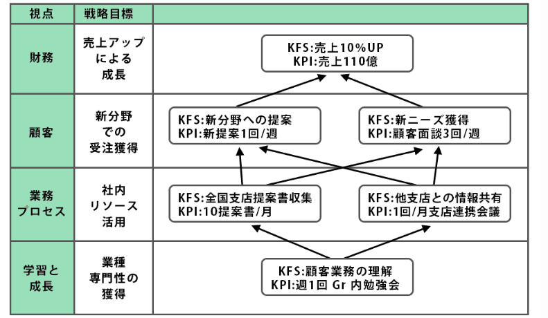

# ストラテジ系

## ソリューションビジネスとシステム活用促進

### ソリューションビジネス
企業が抱えている経営課題や業務上の悩みの解決を目的としたサービス提供事業者のサービス
- オンプレミス
  - 自社の施設内に、自社が保有する情報システムを設置して運用すること

### ハウジングサービスとホスティングサービス
サービス提供事業者画所有する施設やサーバなどを貸し出すサービスがある。その施設には高速回線や地震対策、セキュリティ対策などが施されており、利用する側にとっては運用の手間とコストを削減できるメリットがある。

#### ハウジングサービス
- サービス提供事業者がサーバを設置する施設を貸し出すサービス

#### ホスティングサービス
- サービス提供事業者がサーバを貸し出すサービス

### クラウドコンピューティング
- インターネット上のハードウェアやソフトウェアなどを物理的にどこにあるのかを意識することなく、自社から利用する形態

- クラウドサービス
  - サーバやOSソフトウェアなどを所有して提供するサービス
  - IaaS,PaaS,Saasの３種がある

  - さらにDaaSがある。
    - サービス提供事業者がシンクライアントシステムをネットワーク経由で提供するサービス
  - ASP
    - Application Service Provider
    - 業務アプリをネットワーク経由で提供する事業者です。
  - パブリッククラウド
    - 不特定多数の利用者に提供する
  - プライベートクラウド
    - 特定の企業や個人だけに提供

### SOA
Service Oriented Architecture
- サービス指向アーキテクチャ
- 業務プロセスの機能をサービスとして部品化し、そのサービスを組み合わせることによって、情報システム全体を構築していく考え方

### SI
- システムインテグレーション
- 情報システムの企画から開発・運用・保守までの業務を請け負うサービス

### システム活用促進
- 情報リテラシー
  - PCを利用して情報の整理や蓄積、分析を行ったり、インターネットなどを使って、情報を収集・発信したりする情報を取り扱う能力

#### デジタルディバイド
- PCやインターネットなどのITを利用する能力や機械の違いによって生じる経済的・社会的な格差
- RPA
  - 人がPC上で行う定形的な操作をロボットと呼ばれるソフトウェアにより自動化・効率化すること

## 経営組織と経営・マーケティング戦略

### 経営組織
経営組織の代表的な形態として、次のようなものがある。
- 職能別組織
  - 生産、販売、人事、財務などの仕事の性質によって部門を編成した組織
- 事業部制組織
  - 社内を製品、顧客、地域などの事業ごとに分割し、編成した組織。編成された組織単位に自己完結的な経営活動が展開できる。
- マトリックス組織
  - 構成員が、事故の専門とする職能部門と特定の事業を遂行する部門の両方に所属する組織。
- プロジェクト組織
  - 特定の問題を解決するために、一定の期間に限って結成される組織。問題が解決されると解散する。

### 経営戦略
経営戦略は、企業全体を対象とした全社戦略、個別の事業を対象とした事業戦略、営業、開発、生産、人事、などの部署を対象とした機能別戦略の視点から策定されます。

### 全社戦略
全社戦略は、企業全体の視点から進むべき方向性を示したものです。自社がどの事業領域を核とするのかを示し、経営資源であるヒトモノカネ情報を集中させていきます。自社の経営資源だけでは不十分な場合は、他社の経営資源で保管していくことも考える

#### コアコンピタンス
- 競合他社がまねのできない独自のノウハウや技術などに経営資源を集中し、競争優位を確立する手法
- コアには、核　コンピタンスには能力という意味がある。

#### ベンチマーキング
- 最強の競合他社、または先進企業と比較して、製品やサービス、オペレーションなどを定性的・定量的に把握する手法
- 優れた業績を上げている企業との比較分析から、自社の経営革新を行います。

#### RPM
- Product Portfolio Management
- 事業や製品を花型、負け犬、金の生る木、問題児の四つのカテゴリに分類し、経営資源の最適配分を意思決定する手法

#### M&A
- Mergers and Acquisitions
- 起業の合併・買収

#### アライアンス
- 企業同士の連携
- 他社と競合することなく、自車で不足している経営資源を他社との連携によって保管します。

#### アウトソーシング
情報システムのコストを削減するために、情報システムの開発や運用・保守に関わる全部または一部の機能を外部の専門企業に委託する携帯
- オフショアアウトソーシング
  - 海外の安い人に外部委託すること
- BPO
  - Business Process Outsourcing
  - 自社の業務を含めて外部企業に委託すること

### 事業戦略
事業ごとに進むべき方向性を示したもの

#### SWOT分析
- 起業の経営環境を内部環境である強みと弱み、外部環境である機会と脅威の4つのカテゴリに分類し分析する手法

#### バリューチェーン分析
- 起業の事業活動を機能ごとに主活動と支援活動に分け、企業が顧客に提供する製品やサービスの利益などの付加価値が、どの活動で生み出されているかを分析する手法

#### 成長マトリクス
- 製品と市場の２軸に、それぞれ新規と既存の観点から事業を市場浸透、市場開拓、製品開発、多角化の４つのタイプに分類し、事業の方向性を分析する手法

### マーケティング戦略
- 顧客が自社の製品やサービスに満足してもらうことで、継続的に売れる仕組みを作る一連の活動
  - 顧客満足度 が重要な要素となる
    - CS(Customer Satisfaction)

#### プロダクトライフサイクル
- 製品を、導入期、成長期、成熟期、衰退期の４つの段階に分類し、企業にとって最適な戦略を分析する手法

- PLM
  - Product Lifecycle Management
  - 企画や発売から廃棄までの一連のサイクルを通じて、製品の情報を一元管理し、商品力向上やコスト低減を図る取り組み

#### STP分析
- STP分析
  - 次の３つの観点で分析すること
  - セグメンテーション
  - ターゲティング
  - ポジショニング

#### コトラーの競争戦略
- マーケットシェアの観点からリーダ、チャレンジャ、フォロワ、ニッチャの４つに分類し、競争上の地位に応じた戦略をとる手法

#### マーケティングミックス
- 製品戦略、価格戦略、チャネル戦略、プロモーション戦略などを適切に組み合わせて、自社製品を効果的に販売していく手法
  - 売り手から見た要素は４P
  - 書いてから見た要素は４C

#### コストプラス価格決定法
- 製造原価、または仕入れ原価に一定のマージンを乗せて価格を決定する手法
- 競争指向型
  - 競争相手の価格を反映する
- ターゲットリターン型
  - 目標とするROIを実現できる価格に設定する
- 需要指向型
  - 一番売れそうな価格に設定する。

#### イノベータ理論
新製品をすぐ購入する人もいれば、あまり関心のない人もいる。
イノベータ理論では消費者を新製品への関心が高い順に五つに分類している。

アーリーアダプタとアーリーマジョリティの間には重要視するポイントの違いによる溝（キャズム）があるといわれている。

## 業績評価と経営管理システム

### 業績評価手法
#### BSC
- Balance Score Card
- バランススコアカード
  - 起業のビジョンや戦略を実現するために、財務、学習と成長、顧客、業務プロセスの4つの視点から具体的に目標を設定して業績を評価する手法

BSCでは四つの視点において、次のKGI、KPI, CSFを設定し、モニタリングを繰り返して継続的に改善して行きます。
- KGI
  - Key Goal Indicator
  - 目指すべき最終的な目標となる数値。「重要目標達成指標」と訳される
- CSF
  - Critical Success Factor
  - 最終目標を達成するために必要不可欠となる要因。「重要成功要因」と訳される。
- KPI
  - Key Perfomance Indicator
  - KGIを細分化した中間的な目標となる数値。「重要業績評価指標」と訳される。訪問数。客単価など

### 経営管理システム
経営管理システムは、今まで個人別や部署別など、ばらばらに管理していた情報を１か所に集約し、全社的、さらには企業間で情報を共有することで効率的な経営の実現を支援するシステム
#### CRM
- Customer Relationship Management
- 個別の顧客に関する情報や対応履歴などを一元管理し共有することで、長期的な視点から顧客との良好な関係を築き、収益の拡大を図る手法
  - 顧客関係管理と訳される
- 顧客生涯価値
  - 顧客満足度や一人の顧客が企業にもたらす価値

- SFA
  - Sales Force Automation
  - 個人が持つ営業に関する知識やノウハウなどを一元管理し共有することで、効率的、効果的に営業活動を支援する手法
  - コンタクト管理
    - SFAの基本的な機能の一つ
    - 顧客訪問日、営業結果などの履歴を管理し、見込み客や既存客に対して効果的な営業活動を行う。SFAはCRMの一環として行われる

#### SCM
- Supply Chain Management
- サプライチェーン
  - 部品調達、生産、物流、販売までの一連のプロセス
- サプライチェーンの情報を一元管理し共有することで業務プロセスの全体最適化を図る手法
- リードタイム(商品受注から納品までの期間)の短縮や在庫コストや流通コストの削減が目的

- 3PL
  - サードパーティロジスティクス
  - 起業の物流機能のすべて、または一部を外部の企業に委託すること

#### ERP
- Enterprise Resource Planning
- 生産、流通、販売、財務、経理などの企業の基幹業務の情報を一元管理し共有することで、企業の経営資源の最適化を図る手法

#### ナレッジマネジメント
社員個人がビジネス活動から得た客観的な知識や経験、ノウハウなどを一元管理し共有することで、全体の問題解決力を高める経営を行う手法

## 技術開発戦略
### 技術開発戦略
技術開発戦略は企業を持続的に発展させていくために、技術開発への投資也イノベーションの促進を図り、技術と市場のニーズを結びつける戦略
#### MOT
- Management of Technology
- 高度な技術を核とする技術開発に投資し、イノベーションを創出することで、技術革新を事業に結び付けていく経営
- 技術経営と訳される
#### イノベーション
- 今までにない、画期的な新しいものを作り出すこと
#### APIエコノミー
- 企業同士がAPIを使ってサービスを連携させることで生まれる新しい経済圏
#### オープンイノベーション
企業内部にとどまらず、他企業や他業種、大学、地方自治体、官公庁などと協力して、互いの専門知識を生かしてイノベーションを起こそうという考え
#### ハッカソン
開発者やデザイナーなどが集まってチームを組み、数時間也数日間の日程で与えられた課題にチャレンジするイベント
#### 魔の川、死の谷、ダーウィンの海
- 魔の川
  - 基礎研究が製品開発に結びつかないこと
- 死の谷
  - 製品開発が事業に結びつかない事
- ダーウィンの海
  - 事業化ができても市場に浸透できないこと
#### 技術のSカーブ
- 技術の進歩の過程を示した曲線
- 最初は緩やかに進歩するが、やがて急激に進歩し、その後穏やかに停滞していく
#### デザイン思考
- 利用者も気づかないような潜在的なニーズを掘り起こし、イノベーションを生み出そうとする考え方
#### 技術ロードマップ
- 将来の技術動向を予測して進展の道筋を時間軸上に表したもの
#### デルファイ法
- 複数の専門家からの意見を収集、収集した意見を集約、集約された意見をフィードバック　というプロセスを繰り返すことで意見を収束させていく手法
