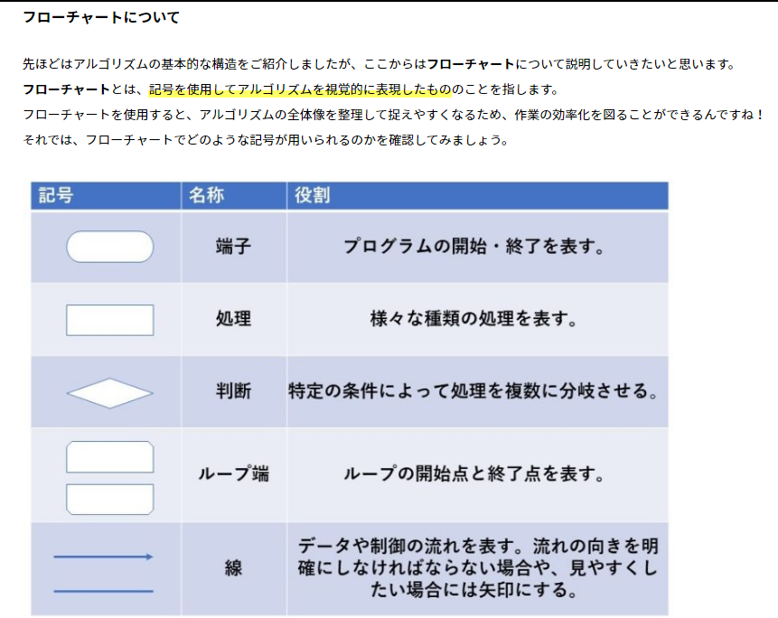
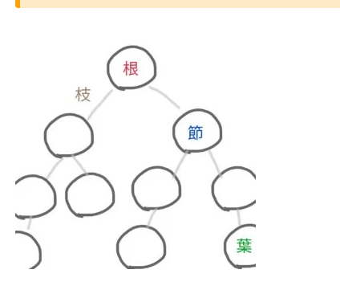
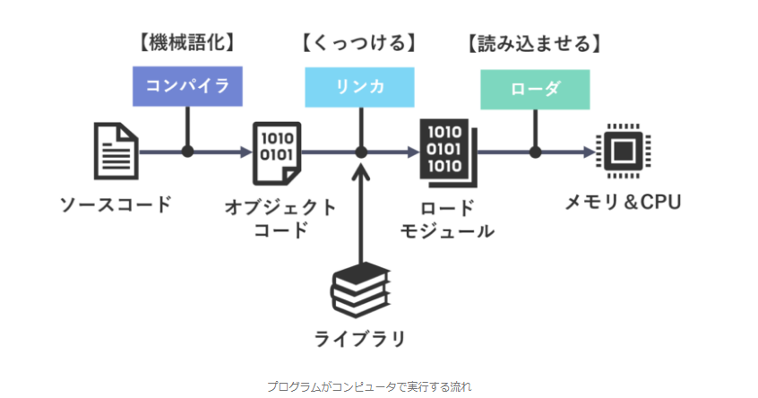

# アルゴリズムとプログラミング
- [アルゴリズムとプログラミング](#アルゴリズムとプログラミング)
  - [アルゴリズム](#アルゴリズム)
    - [アルゴリズム](#アルゴリズム-1)
    - [変数](#変数)
    - [フローチャートと疑似言語](#フローチャートと疑似言語)
      - [フローチャート](#フローチャート)
      - [アルゴリズムの制御構造](#アルゴリズムの制御構造)
      - [アルゴリズムの例](#アルゴリズムの例)
      - [疑似言語](#疑似言語)
  - [配列](#配列)
    - [データ構造](#データ構造)
    - [配列](#配列-1)
  - [リスト](#リスト)
    - [リスト](#リスト-1)
      - [リスト構造の種類](#リスト構造の種類)
      - [配列とリスト構造の比較](#配列とリスト構造の比較)
    - [キュー](#キュー)
    - [スタック](#スタック)
  - [木構造](#木構造)
    - [木構造](#木構造-1)
    - [2分木の種類](#2分木の種類)
      - [完全2分木](#完全2分木)
      - [2分探索木](#2分探索木)
      - [ヒープ木](#ヒープ木)
    - [逆ポーランド記法](#逆ポーランド記法)
  - [データの整列](#データの整列)
    - [データの整列](#データの整列-1)
    - [代表的な整列法](#代表的な整列法)
      - [基本交換法](#基本交換法)
      - [基本選択法](#基本選択法)
      - [基本挿入法](#基本挿入法)
    - [その他の整列法](#その他の整列法)
      - [シェルソート（改良挿入法）](#シェルソート改良挿入法)
      - [クイックソート](#クイックソート)
      - [ヒープソート](#ヒープソート)
  - [データの探索](#データの探索)
    - [データの探索](#データの探索-1)
      - [線形探索法](#線形探索法)
      - [2分探索法](#2分探索法)
      - [ハッシュ探索法](#ハッシュ探索法)
  - [アルゴリズムの計算量](#アルゴリズムの計算量)
    - [計算量（オーダ）](#計算量オーダ)
    - [オーダの求め方](#オーダの求め方)
    - [オーダ表記](#オーダ表記)
      - [データ量をnとしたときのオーダ記法と計算量のまとめ](#データ量をnとしたときのオーダ記法と計算量のまとめ)
  - [プログラムの属性](#プログラムの属性)
    - [プログラムの属性](#プログラムの属性-1)
      - [再帰的な関数の例](#再帰的な関数の例)
  - [プログラム言語とマークアップ言語](#プログラム言語とマークアップ言語)
    - [プログラム言語](#プログラム言語)
    - [言語プロセッサ](#言語プロセッサ)
    - [プログラムの実行手順](#プログラムの実行手順)
      - [コンパイル](#コンパイル)
      - [リンク](#リンク)
      - [ロード](#ロード)
    - [その他の言語プロセッサ](#その他の言語プロセッサ)
    - [開発ツール](#開発ツール)
      - [統合開発環境](#統合開発環境)
      - [デバッグツール](#デバッグツール)
    - [形式言語](#形式言語)
      - [BNF記法](#bnf記法)
      - [正規表現](#正規表現)
    - [マークアップ言語](#マークアップ言語)
      - [SGML](#sgml)
      - [HTML](#html)
      - [XML](#xml)
    - [Ajax](#ajax)

## アルゴリズム
### アルゴリズム
アルゴリズムは何らかの問題を有限の時間で解くための手順

### 変数
スキップ

### フローチャートと疑似言語
アルゴリズムを記述する方法にはフローチャートや科目Bに出題される疑似言語などがある。
#### フローチャート
フローチャートは次のような記号を用いてアルゴリズムを記述する方法です。流れ図とも呼ばれています。
以下の種類があります。

#### アルゴリズムの制御構造
アルゴリズムは３つの制御構造 **①順次**、**②選択**、**③繰返し**を用いて作成する。

- 選択（分岐）
  - 選択には双岐選択と多岐選択がある。
    - 双岐選択
      - ２つの処理のうちいずれかを選択する
    - 多岐選択
      - ３つ以上の処理のうちいずれかを選択する
- 繰返し
  - 繰返しには前判定繰返しと後判定繰返しがある。
    - 前判定繰返し
      - 繰返し処理の前で終了条件の判定を行う。終了条件次第で処理を一回も実行しないこともある。
    - 後判定繰返し
      - 繰返し処理の後で終了条件の判定を行う。終了条件に関わらず処理を少なくとも１回は実行する。

#### アルゴリズムの例
スキップ

#### 疑似言語
科目Bで必須のアルゴリズムはフローチャートではなく疑似言語で出題される。実際にプログラミング言語で記述する場合と近いイメージです。選択、順次、繰返しのみを使われる。

- [試験で使用される疑似言語の仕様](./shiken_yougo_ver5_0.pdf)

## 配列
### データ構造
データ構造はデータを効率よく管理するための形式です。

### 配列
- 配列は同じ型（整数型、実数型、文字列型）の連続したデータを扱うことができる構造
- 配列中に格納された各データを**要素**という。
- 各要素には先頭から１，２，３という**要素番号**（添え字）がつけられる
- １次元配列
  - １つの行のみで構成された配列
- ２次元配列
  - ２つの行で構成された配列

配列は要素番号を変数化することができるため、繰返しのアルゴリズムと組合わせることで、配列の各要素の処理を要素番号を変化させながら繰り返すことできる。

## リスト
### リスト
リストはデータを記録するデータ部とデータの格納位置を示すポインタ部で構成されるデータ構造です。

ポインタを辿ることで、データを取り出すことができます。ポインタ部には次のデータや前のデータのアドレス（格納場所）が入っています。

#### リスト構造の種類
いろいろあるよ
- 単方向リスト
  - 次のデータへのポインタを持っている。
- 双方向リスト
  - 次のデータへのポインタと、前のデータへのポインタを持っている。
- 環状リスト
  - ポインタを辿り、データが環状に連結されている。

#### 配列とリスト構造の比較
配列、リストはともにデータの順番と値を格納しますが、以下の違いがある。

| 違い               | 配列                                     | リスト                                   |
| :----------------- | :--------------------------------------- | ---------------------------------------- |
| 格納領域           | 連続領域に順番通りに格納                 | 非連続領域・非順番通りで可               |
| 総データ数         | 先に決定（無駄な領域も発生）             | 柔軟に変更可能                           |
| データ挿入・削除   | 後ろのデータもずらす必要があり処理時間大 | 前後のポインタのみ修正するので処理時間小 |
| データへのアクセス | 要素番号ですぐアクセスできる             | ポインタを辿るので遅い                   |

### キュー
キューは格納した順序でデータを取り出すことができるデータ構造
- FIFOの特徴がある。
  - First-In First-out:先入れ先出し
  - 最初に格納したデータは最初に取り出す
- エンキュー（enqueue）
  - キューにデータを格納すること
- デキュー（dequeue）
  - キューからデータを取り出すこと
- キューはジョブ待ちの待ち行列などにも用いられています。

### スタック
スタックとは格納した順序とは逆の順序でデータを取り出すことができるデータ構造
- LIFOの特徴がある。
  - Last-In First-Out:後入れ先出し
- プッシュ（push）
  - スタックにデータを格納すること
- ポップ（pop）
  - スタックからデータを取り出すこと
- スタックは再起呼び出しや割込み時のデータ退避などにも用いられている。

## 木構造
### 木構造
木構造（ツリー構造）階層の上位から下位に節点を辿ることによってデータを取り出すことができるデータ構造です。

- ノード(節)
  - 〇の部分
- 枝(ブランチ)
  - 節と節をつないだ線の部分
- 葉(リーフ)
  - 最下位の節
- 根（ルート）
  - 最上位の節

木構造の各節どうしには親子関係がある
- 親
  - 上位の節
- 子
  - 下位の節
- 部分木
  - 節にぶら下がっている部分
  - 左部分木
    - 左側にぶら下がっているもの
  - 右部分木
    - 右側にぶら下がっているもの

### 2分木の種類
全ての枝の分岐が二つ以下である木構造
次の種類がある
#### 完全2分木
- 根から葉までの深さがすべて等しい2分木
- ただし深さが１だけ深い葉がありき全体の左から詰められているものも完全２分木とされる。

#### 2分探索木
- 各節において、「左の子＜親＜右の子」という関係を持った2分木
- 根から葉に向かってデータを探索する際に用いられ次の手順でデータを探索する。
  1. 根から順に各節の値と比較する
     - 節の値と同じなら探索を終了する→該当データあり
     - 節の値より小さければ左部分木へ移動する
     - 節の値より大きければ右部分木へ移動する 
  2. １を繰り返す
  3. 浜で達しても一致しないなら探索を終了する。→該当データなし

#### ヒープ木
各節において「親＜子」または「親＞子」という関係を持った完全2分木です。

### 逆ポーランド記法
逆ポーランド記法は数式の記述方法の一つで、演算子を被演算子の後に記述する表記法です。

２分木を用いて、節に演算子、葉に被演算子を配置します。この記法では、左部分木→右部分木→節点の順に取り出します。
- 例
  - $(4+3)\times(2-1)$を逆ポーランド記法で求めてみよう。※スタックを使う
    1. 被演算数はスタックにPUSHする
    2. 演算しはスタックから２個のデータをPOPする
    3. ２個のデータの計算結果をスタックにPUSHする
  > $43+21-\times$左から順に演算する
- [計算方法の参考](https://it.sumahotektek.com/it-reverse-polish-notation/#toc3)

## データの整列
### データの整列
- 整列はある規則に従ってデータを並べ替えること。
  - ソートとも呼ばれている。
- 昇順、降順など並べ替える順番の規則がある。
- [整列法についてのまとめ記事](https://medium-company.com/%E5%9F%BA%E6%9C%AC%E6%83%85%E5%A0%B1-%E6%95%B4%E5%88%97%E3%82%A2%E3%83%AB%E3%82%B4%E3%83%AA%E3%82%BA%E3%83%A0/)
- 問題解きながらのほうが良さそう

### 代表的な整列法
代表的な整列法として、基本交換法や基本選択法、基本挿入法がある。
#### 基本交換法
- 隣り合うデータを比較し、逆順であれば交換していく整列法
#### 基本選択法
- データ列の最小値（または最大値）を選択して交換し、次にそれを除いた部分の中から最小値（または最大値）を選択して交換していく整列法
#### 基本挿入法
- すでに整列済みのデータ列の正しい位置にデータを挿入していく整列法

### その他の整列法
#### シェルソート（改良挿入法）
シェルソートはある一定間隔沖に取り出した要素内で基本挿入法を用いて整列させ、間隔を詰めながら、間隔が１になるまで繰り返していく整列法です。
#### クイックソート
クイックソートは適当な基準値を決めて「基準値より小さい値」のグループと「基準値より大きい値」のグループに分ける操作を繰り返していく整列法。一般的にはほかのソートよりも効率がよく、早いとされている。
#### ヒープソート
ヒープソートは未整列の部分を順序木に構成し、その最大値（または最小値）を取り出す操作を繰り返していく整列法

## データの探索
### データの探索
探索は配列などを使って目的のデータを探し出すことです。代表的な探索法に線形探索法や２分探索法、ハッシュ探索法がある。
- [探索アルゴリズムまとめ](https://medium-company.com/%E5%9F%BA%E6%9C%AC%E6%83%85%E5%A0%B1-%E6%8E%A2%E7%B4%A2%E3%82%A2%E3%83%AB%E3%82%B4%E3%83%AA%E3%82%BA%E3%83%A0/)

#### 線形探索法
- 配列の先頭から順番に目的のデータを探索していく方法です。
- 不規則に配列されている多数のデータの中から目的のデータを探し出すのに適している。
- 探索に時間がかかる。

- 番兵法
  - 線形探索法をベースにちょっと改造したもの
  - 探索したい目的のデータを配列の最後に追加する方法
  - > 行列の最後に最後尾などの看板を持っている係員がいることがあるが、そのようなイメージ
  - [番兵法について](https://qiita.com/kotaito/items/b912ce11510d09103f30#%E7%95%AA%E5%85%B5%E6%B3%95)

- 線形探索法の探索回数
  - Nこのデータにおいて、線形探索法で探索した場合は、探索回数は最小１回、最大でN回、平均探索回数は（N+1）／２です。

#### 2分探索法
- 2分探索法は、探索範囲を半分に絞り込みながら目的のデータを探索する方法です。
- 二つに分けて絞り込んでいく方法です。
- データはあらかじめ昇順または降順に並んでいることが前提です。
- 2分探索法の探索回数
  - 2分探索法では、探索範囲を半分に絞り込みながら探索する。
  - 逆に言うと、データ量が２倍になるごとに探索回数が１回増えていく
  - N個のデータにおいて２分探索法で探索した場合、平均比較回数は$log_2N$回、最大比較回数は$log_2N+1回$です。
    - > 南海探索すれば目的データを探し出せるか、は何回範囲を半分にすればよいか、と同じことです。もしデータ数が32ならば$2^5=32$なので平均的に5回半分に、つまり五回探索すれば目的データが見つかるはず。では２の累乗ではない50個のデータならどうなるか。32と64の間なので平均的には５～６回の間の数と想像つきます。
    -  > Nは２の何乗くらいか、が$log_2Nの意味です。log_264=6となります。log_250を計算すると約5.64になります。$
    - 2分探索法の平均比較回数と最大比較回数
    
      $2^k \leqq N<2^{k+1}$
- [log(対数について)](https://lab-brains.as-1.co.jp/enjoy-learn/2023/02/41579/)
  - 指数（累乗の個数を示す値。例：$2^4$の4の事）には累乗値がある
  - この累乗値を求めるのが対数

> まぁ問題解いたほう速そう
#### ハッシュ探索法
目的のデータの格納先のアドレスをハッシュ関数を用いて算出して探索する方法
- データの格納先を前もって決めておく方法
- 格納先アドレスはデータの値に一定の演算をして求める。
- この時に用いるのがハッシュ関数
- ハッシュ関数で生成された格納先アドレスが衝突（同じハッシュ値になること）することを**シノニム**という。シノニムが発生すると再度別の方法で格納先アドレスを求める必要がある。
- ハッシュ探索法の探索回数
  - ハッシュ値が衝突する確率が無視できるほど小さいとした前提だと、探索回数は１となる。一回だけでおｋ
  - ハッシュ値が衝突する可能性が最も低くなるのはハッシュ値が一様分布で近似されるとき。
    - 一様分布は例えばサイコロを振るとどの目の出る確率も等しく1/6であるような全ての事象が起こる確率が一定である確率分布

## アルゴリズムの計算量
### 計算量（オーダ）
アルゴリズムの計算量はデータ量の増加に対して、アルゴリズムの実行時間がどれくらい増加するかを割合で表した指標
- オーダを使えば実際にプログラムをすべて完成させなくてもアルゴリズムだけで実行時間の大まかな見積もりができる。
- 通常は実行時間が短いほうが良いが例えば暗号化の場合は実行時間が長いアルゴリズムを使うと解読するのに時間がかかることになり、より強固な暗号になる。
- 処理するデータ量が少ない場合は、オーダで考える意味はない。

### オーダの求め方
例えばｎ個のデータを処理する最大実行時間が$Cn^2$（Ｃは定数）で抑えられるときは実行時間のオーダが$n^2$である。計算式の中で一番指数が大きい項（最高次数の項）だけを考え、それ以外の定数や係数は無視して考える。
- 実行時間とオーダの関係

| 実行時間       | オーダ |
| :------------- | :----- |
| Ｃ（定数）     | １     |
| 100n           | n      |
| $3n^2+5n+1000$ | $n^2$  |
- 一番指数が大きい項だけを考える

- ルール１　最高次数の項以外は除く
  - 例えばデータ量n=10000で実行時間が$3n^2+5n+1000だとする。この式にnを代入すると、3^nの部分は300000000になるが、残りの部分は51000にしかならず、データ量（n）が最高次数の項の部分が効いて無視できるということ$
- ルール２　係数は除く
  - 計算量の定義上、定数倍程度の違いは無視する
  - 例えばn,5n,100nはいずれもn

### オーダ表記
- アルゴリズムの計算量をＯ（オーダ）で表す。
- 例えばO($n^2$)はデータ量がｎのときに$n^2$に比例して計算量が増えていくという意味
- アルゴリズムが順次処理だけで構成されている場合はnと計算量は無関係であり、O（１）とあらわす。ｎ下位の繰返しが１重ならｎに比例しＯ（ｎ）、n回の繰返し２重ならオーダを掛け合わせるので、Ｏ($n^2)とあらわす。

#### データ量をnとしたときのオーダ記法と計算量のまとめ
| オーダ記法  | 計算量          | 計算量の変化(nを100->10000) | 実行時間のイメージ |
| :---------- | :-------------- | --------------------------- | ------------------ |
| O(1)        | nと無関係に一定 | 変わらず                    | 相当早い           |
| O$(log_2n)$ | ｎの対数に比例  | ２倍                        | 早い               |
| O(n)        | ｎに比例        | １００倍                    |                    |
| O$(n^2)$    | ｎの２乗に比例  | １００００倍                | 遅い |

- 整列アルゴリズムの計算量
基本交換、選択、挿入法の計算量は$O(n^2)$となる
- 探索アルゴリズムの計算量
  - 線形探索法
    - $O(n)$
  - 2分探索法
    - $O(log_2n)$
  - ハッシュ探索法
    - O(1)

## プログラムの属性
### プログラムの属性
いろんな属性があるよ
- 再配置可能
  - リロケータブル
  - 主記憶上のどのアドレスに配置しても実行できる。再配置可能な処理を実現するには、プログラムの先頭アドレスを基底レジスタに設定し、プログラムの先頭からの相対アドレスを用いることで、プログラムを変更せずに主記憶上の任意のアドレスに配置できる。
- 再入可能 
  - リエントラント
  - 同時に複数のタスク（プロセス）が共有して実行しても正しい結果が得られる。再入可能な処理を実現するには、プログラムを手続部分とデータ部分に分割し、データ部分をタスク（プロセス）ごとに持つ必要がある。
- 再使用可能
  - リユーザブル
  - 一度実行した後、ロードしなおさずに再び実行を繰り返しても正しい結果が得られる。再使用可能な処理を実現するには、プログラム終了後にプログラム中で使用している変数の値を初期化イニシャライズする必要がある。
- 再帰的
  - リカーシブ
  - 実行中に自分自身を呼び出せる。再帰的な処理を実現するには実行途中の状態を、スタックを用いてLIFO方式で記録し制御する必要がある。

#### 再帰的な関数の例
- 関数は与えられた値をもとに関数内の定められた処理を実行してその結果を返す機能を持ったもの
- 再帰的な関数では処理を繰り返すときの条件と計算式と、処理を終了させるときの条件と値を必ず明記する。値を求める場合は、まず終了条件に合致するまで処理を繰り返す。終了条件に合致すると具体的な値が決まるのでその値をこれまで求めた式に代入してく。

## プログラム言語とマークアップ言語
### プログラム言語
プログラム言語には大きく分けて次の２つの分け方ができる。
- 低水準言語
  - 機械語に近い。コンピュータが理解しやすい
- 高水準言語
  - 人間が理解しやすい。
  - 現状ポピュラー

### 言語プロセッサ
- 記述した原始プログラムをコンピュータが理解できる機械語に翻訳するためのプログラム
- 原始プログラムはソースプログラム、ソースコードと呼ばれる。
- 言語プロセッサにはのような種類がある。
  - アセンブラ
    - アセンブラで書かれた原始プログラムを機械語に翻訳する
  - インタプリタ
    - 高水準言語で書かれた原始プログラムを１命令ずつ解釈しながら実行する
  - コンパイラ
    - 高水準言語で書かれた原始プログラムを一括して目的プログラムに翻訳する。

### プログラムの実行手順
コンパイラ方式では次の手順でプログラムを実行する。

#### コンパイル
- コンパイラというプログラムを使用して原始プログラムから目的プログラムを生成すること
- コンパイラによる最適化の主な目的は実行時の処理効率を高めたオブジェクトコードを生成してプログラムの実行時間を短縮すること

#### リンク
- リンク（連係編集）はリンカ（リンケージエディタ）と呼ばれるプログラムを使用して複数の目的プログラムから一つのロードモジュール（実行可能プログラム）を生成すること

#### ロード
- ローだと呼ばれるプログラムを用いて実行に先立ってロードモジュールを主記憶上に配置すること

### その他の言語プロセッサ
- プリコンパイラ
  - 高水準言語に付加的に定義された機能と文法に従ってコーディングされたプログラムをもとの高水準言語だけを使用したプログラムに変換する
- クロスコンパイラ
  - あるコンピュータを使ってそのコンピュータとは異なる命令形式を持つコンピュータで実行できる目的プログラムを生成する。
- ジェネレータ
  - 入力、処理、出力などの必要な条件をパラメタで指定して、処理目的に応じたプログラムを自動的に生成する。
- トランスレータ
  - ある処理用に書かれた原始プログラムをほかの処理系の原始プログラムに変換する
- エミュレータ
  - ほかのコンピュータ用プログラムを解読し、実行する。

### 開発ツール
#### 統合開発環境
スキップ

#### デバッグツール
以下のツールがある。
- トレーサ
  - プログラムの命令実行順序や実行結果を時系列で出力する
- スナップショットダンプ
  - プログラムの特定の命令を実行するごとに指定されたメモリの内容を出力する
- メモリダンプ
  - プログラムの異常終了時に主記憶やレジスタの内容を出力する
- 静的解析ツール
  - 文法誤りやルール違反、モジュールインタフェースなどを解析するツール

### 形式言語
- 特定の目的の為に人為的に作られた言語

#### BNF記法
- プログラム言語の構文を定義する再帰的な記法
- XMLの構文なんかにも使われている

#### 正規表現
スキップ

### マークアップ言語
- タグと呼ばれる特殊な文字を使って文章の構造や文字の修飾などを記述する言語

#### SGML
- 電子的な文書の管理や交換を容易に行うためのマークアップ言語

#### HTML
- Webページを作成するためのマークアップ言語
- CSS
  - 文字の大きさや色、行間などの視覚表現を指定する。

#### XML
- ネットワークを介した情報システム完のデータ交換を容易にするためのマークアップ言語
- 文章の構造を文字型定義（DTD:Document Type Definition）として記述し、利用者独自のタグを定義できる

### Ajax
- Asynchronous JavaScript + XML
- XMLとJavaScriptが持つ非同期のHTTP通信機能を使い、動的に画面を再描画する仕組み

