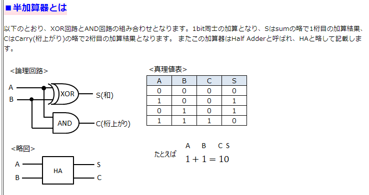
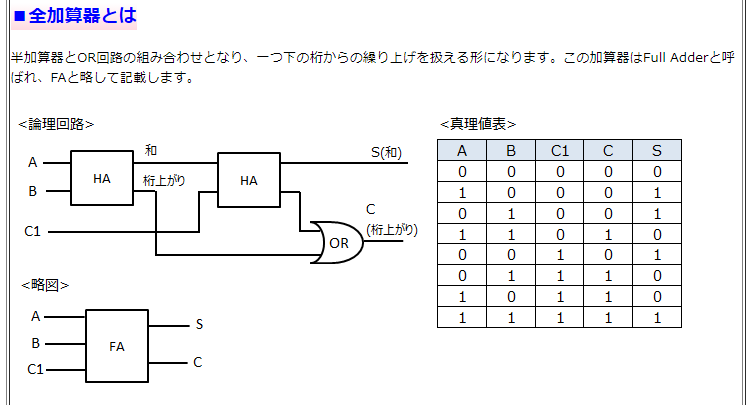

# 基礎理論
- [基礎理論](#基礎理論)
  - [基数変換](#基数変換)
  - [補数](#補数)
    - [補数](#補数-1)
      - [2の補数の作り方](#2の補数の作り方)
    - [固定小数点](#固定小数点)
  - [浮動小数点](#浮動小数点)
      - [浮動小数点の形式](#浮動小数点の形式)
  - [誤差](#誤差)
    - [誤差](#誤差-1)
      - [桁あふれ誤差](#桁あふれ誤差)
      - [丸め誤差](#丸め誤差)
      - [桁落ち誤差](#桁落ち誤差)
      - [情報落ち誤差](#情報落ち誤差)
      - [打ち切り誤差](#打ち切り誤差)
  - [シフト演算](#シフト演算)
    - [シフト演算](#シフト演算-1)
    - [論理シフト](#論理シフト)
    - [算術シフト](#算術シフト)
      - [算術左シフト](#算術左シフト)
      - [算術右シフト](#算術右シフト)
    - [シフト演算まとめ表](#シフト演算まとめ表)
    - [シフト演算と加算の組み合わせ](#シフト演算と加算の組み合わせ)
  - [論理演算](#論理演算)
    - [論理演算](#論理演算-1)
    - [ビット演算](#ビット演算)
  - [半加算器と全加算器](#半加算器と全加算器)
    - [加算器](#加算器)
      - [半加算器](#半加算器)
      - [全加算器](#全加算器)
  - [計測と制御](#計測と制御)
    - [アナログとデジタル](#アナログとデジタル)
      - [A/D変換](#ad変換)
    - [PCM伝送方式](#pcm伝送方式)
      - [標本化](#標本化)
      - [量子化](#量子化)
      - [符号化](#符号化)
    - [制御技術](#制御技術)
      - [PWM](#pwm)
    - [クロック信号](#クロック信号)
    - [電力量](#電力量)
  - [オートマトン](#オートマトン)
    - [オートマトン](#オートマトン-1)
  - [AI](#ai)
    - [AI](#ai-1)
    - [機械学習](#機械学習)
      - [教師あり学習](#教師あり学習)
      - [教師なし学習](#教師なし学習)
      - [強化学習](#強化学習)
    - [ディープラーニング](#ディープラーニング)
  - [線形代数](#線形代数)
    - [スカラーとベクトル](#スカラーとベクトル)
    - [行列](#行列)
      - [行列計算の例](#行列計算の例)
  - [確率・統計](#確率統計)
    - [確率](#確率)
      - [場合の数](#場合の数)
    - [順列](#順列)
    - [組合せ](#組合せ)
    - [統計](#統計)
    - [正規分布](#正規分布)

## [基数変換](./RadixConversion.md)

## 補数

### 補数
2進数でしか判断できないコンピュータ内部で、負数を表現する方法の一つとして、補数表現がある。

- 補数は、ある数を決められた数にするために、「補う数」です。
- N進数には、「Ｎ－1の補数」と「Ｎの補数」がある。
- N-1の補数
  - ある数にＮ－１の補数を補うと、与えられた桁数の最大値となる。
- Nの補数
  - ある数にNの補数を補うと、与えられた桁数の次の桁に桁上がりする。

10進数には９の補数と10の補数の二つがある。
- 例えば10進数3桁で表現する場合 [123]
  - 9の補数は876
    - 123+876=999
  - 10の補数は877
    - 123+877=1000
    - ここで、10進数３桁での表現であるため、桁上がりした千の位の1は無視される。なので、123+877=000となる。
    - つまり、0になるので10の補数877は123の対の負数（-123）の意味にもなってくる。
      > このように補数を使って負数を表現することができる。

- 2進数
2進数にも同じような補数がある。
2進数4ビットで表現「0101」の補数を見てみよう
  - 1の補数は「1010」
  - 2の補数は「1011」
    - 10の補数に同じく、0101の負数としての意味も持っている
- コンピュータ内部では演算回路を簡単にするため、2の補数を利用して負数を表現している。
- 補数を使うことで、減算を加算で処理できる。

#### 2の補数の作り方
- 2の補数は1の補数に+1した値。
- 1の補数は正数（比較対象の正の2進数）のビット反転をした値
- 2の補数（負数）から対の正数を求めるには逆にビット反転して＋１すれば求められる

### 固定小数点
コンピュータ内部における数値の表現方法として、固定小数点と浮動小数点がある。
- 固定小数点は小数点の位置を決められた場所に固定して表現する形式
- 整数型として扱う場合は、最右端の右側に小数点がある。
- 負数を扱う場合は、最左端ビットを符号ビットとした２の補数表現を用いる。
  - 例　2進数8ビットの固定小数点（負数は２の補数）
    - 最小値:10000000  (10進で-128)
    - 最大値:01111111（10進数で127）

## 浮動小数点
浮動小数点は実数（小数点のついた数）を扱う場合に使用する形式。  指数を使うことで大きな数や小さな数を固定小数点よりも少ないビット数で表現できます。

#### 浮動小数点の形式
浮動小数点の形式にはいくつもの種類がある。代表的なのはIEEE754,32ビット（単精度）形式

数値は$(-1^S)\times B\times{2^E}$と表現する

- 符号部　S 1bit
  - 仮数部の符号（０：正、１：負）
- 指数部　E 8bit
  - ２を基数として、実際の値に127を加えたバイアス値
- 仮数部  B 23bit
  - 絶対値を２進数で表す。1.Mとなるように桁移動する。（正規化）

- 試しにやってみよう
- １０進数7.25をIEEE754で表現してみよう
1. 正数なので符号Sに0を入れる
2. 7.25を２進数で表現すると111.01 仮数部が1.Mになるように正規化する。
   - $111.01\times{2^0} -正規化> 1.1101\times{2^2}$
   - 仮数部の最上位から順に1101残りのビットに0を入れる。仮数部の1.は自明なので省略されている。
3. 指数部は2+127=129,2進数に基数変換して10000001を入れる

- こっちのほうが分かりやすい(https://medium-company.com/%E6%B5%AE%E5%8B%95%E5%B0%8F%E6%95%B0%E7%82%B9%E6%95%B0-%E5%9F%BA%E6%9C%AC%E6%83%85%E5%A0%B1%E6%8A%80%E8%A1%93%E8%80%85%E8%A9%A6%E9%A8%93/#i)

## 誤差

### 誤差
電卓なら、８桁、１２桁のように表現できる桁の上限が決まっています。コンピュータ内部でも、数値を指定されたビット数で表現しているために、真の値と表現する値に差が発生します。
これを誤差といって、以下のような種類がある。

#### 桁あふれ誤差
桁あふれ誤差は演算結果がコンピュータの表現できる範囲を超えることで発生する誤差
- オーバーフロー
  - 演算結果が表現できる範囲を超えてしまうこと
- アンダーフロー
  - 浮動小数点では限りなく0に近づいて表現しきれなくなり発生する。

#### 丸め誤差
丸め誤差は指定された桁数で演算結果を表すために切り捨て、切り上げ、四捨五入などを行うことで発生する誤差

#### 桁落ち誤差
桁落ち誤差は絶対値がほぼ等しい数値の間で、同符号の減産や異符号の加算をしたときに有効桁数が減ることで発生する誤差

例 $0.556\times10^7 - 0.552\times10^7$

$= 0.004\times10^7 正規化-> 0.400\times10^7$
> 正規化すると末尾に00が付きますが、これは正確性とは関係のない数字で、有効桁ではない。有効桁は１桁に減ってしまうことになる。このように桁落ち誤差は、有効桁数が減ってしまう現象。

#### 情報落ち誤差
絶対値の差が非常に大きい数値の間で加減算を行ったときに絶対値の小さい数値が計算結果に反映されないことで発生する誤差

例：$0.123\times10^2 + 0.124\times10^{-2}$
> 有効桁数は仮数部３桁
> 浮動小数点どうしを加減算するときは指数をそろえる必要がある。指数は大きいほうにそろえる

↑を踏まえると、、、
$0.123\times10^2+0.0000124\times10^2=0.1230124\times10^2 正規化→0.123\times10^2$
> $0.123\times10^2$となっている。！？小さな数$0.124\times10^{-2}$はどこ行った？？

のように情報落ち誤差は発生する。絶対値の小さな数値の有効桁数の一部または全部が結果に反映されない現象です。
> なお、数多くの数値の加減算を行うときは、絶対値の昇順に数値を並び替えてから計算すると、情報落ちの誤差を小さくすることができる。

#### 打ち切り誤差
浮動小数点数の計算処理の打ち切りを指定した規則で行うことによって発生する誤差

例えば円周率は3.14159と続くが、計算処理を打ち切って3.14とすることによって発生する。

## シフト演算

### シフト演算
左右にビットをずらして（シフトして）乗算や除算の演算をすることを**シフト演算**という。なおシフト演算には符号を考慮しない**論理シフト**と符号を考慮する**算術シフト**がある。

### 論理シフト
符号を考慮しないシフト演算です。論理シフトでは左シフト・右シフト、ともにあふれたビットは捨てられ、空いたビットには０が入る。

### 算術シフト
符号を考慮するシフト演算です。左シフトと右シフトでは空いたビットの取り扱い方が異なる。

#### 算術左シフト
算術左シフトでは符号ビットはそのままの位置にして、あふれたビットは捨てられ、空きビットには０が入る。

#### 算術右シフト
算術右シフトでは符号ビットはそのままの位置に、あふれたビットは捨てられ、空きビットには符号ビットと同じビットが入る。

### シフト演算まとめ表
| シフト種類   | 符号ビット   | あふれたビット | 空いたビット           |
| :----------- | :----------- | -------------- | ---------------------- |
| 論理シフト   | -            | 捨てる         | 0が入る                |
| 算術左シフト | 位置そのまま | 捨てる         | ０が入る。             |
| 算術右シフト | 位置そのまま | 捨てる         | 符号ビットと同じビット |

### シフト演算と加算の組み合わせ
シフト演算を使うと$2^n$倍や$\frac{1}{2}^n$倍は簡単にできることがわかりました。それでは例えば２進数ｍの９倍の値を求めるにはどうすればよい？

この際は9を2のべき乗に分解する。

$$
\begin{align}
&m\times9\\
&=m\times(2^3)+1\\
&=m\times2^3+m
\end{align}
$$
このように変形して、mを3ビット左にシフト移動したものにｍを加えると、9倍の数値を求めることができる。
> 基数変換だけじゃなくてn進数（10進数以外）同士の計算もやっときたい

## 論理演算
### 論理演算
論理演算は１と０または真と偽のように2つの値のうちいずれかの一方の値を持つデータ間で行われる演算です。演算結果も1と0または真と偽です。
論理演算を実際に行う電子回路が論理回路でCPUに組み込まれている。

論理回路は**MIL記号**で図式化したり入力の状態とその時の出力の状態を表にまとめた**真理値表**で表現したりします。ベン図で考えると理解しやすいです。

- [論理演算の図一覧](https://images.app.goo.gl/1gWVtkBGiw1V4EYbA)

それぞれの論理演算の簡単な説明を以下の表に表す
| 論理演算                   | 説明                                                                                                                                    |
| :------------------------- | :-------------------------------------------------------------------------------------------------------------------------------------- |
| 論理和（OR）               | 入力ABのうち、どちらか一方でも１であれば出力は１となる演算　「＋」は論理和を表す。                                                      |
| 論理積(AND)                | 入力ABの両方が１であれば出力が１となる演算　「・」は論理積を表す。                                                                      |
| 否定(NOT)                  | 入力は一つである。入力が０であれば出力は１、入力が１であれば出力は０になる演算。　「Ā」はAの否定を表す。                                |
| 排他的論理和(EORまたはXOR) | 入力ABが異なる入力値の場合、出力は１となる演算　「⊕」は排他的論理和を表す　また、排他的論理和は$A\cdot\overline{B}+\overline{A}\cdot B$ で表す。|
| 否定論理和(NOR)            | 論理和と否定を組み合わせた演算。入力ABどちらもない状態（０）にのみ出力があります。 $\overline{A+B}$は否定論理和を表す。　$A+B(論理和)$の否定形です。                |
| 否定論理積(NAND)           | 論理積と否定を組み合わせた演算。　「$\overline{A\cdot B}$」は否定論理積を表す |

### ビット演算
元のビット列と特定のビット列との間でビット演算を行い、ある特定のビットを取り出したり、反転させたりすることができる。この時の「特定のビット列」はマスクパターンと呼ばれている。

例えば、２進数ビットの下位４ビットを操作してみる。
- 下位４ビットを操作するには下位４ビットに１、それ以外のビットに０を入れたビット列をマスクパターンとして使う。
> 00110001 -> 00001111

- [ビット列取り出し、反転について](https://www.sumappu.com/post-1138/#)

## 半加算器と全加算器
### 加算器
加算器は2進数の加算を行う回路

#### 半加算器
二つの２進数を加算して同桁の値(S)と桁上がり(C)を出力する加算器
> ただし、皆生宝の桁上がりを考慮しないため、最下位桁で用いられる。

- 2進数一桁の加算をするには４パターンがある。

加算結果の同桁の値(S)は、入力(X,Y)が異なるときのみ出力は１になっているため排他的論理和、桁上がり(C)は入力(X,Y)が両方のときのみ出力は1になっているため論理積で表現できます。
- 半加算器は排他的論理和と論理積の組み合わせで実現しています。
- 半加算器の論理回路図、真理値表

#### 全加算器
上位桁への桁上がり(C)だけでなく、下位桁からの桁上がり(C')も考慮した加算器。最下位桁以外の桁で用いられる。
- 入力(X,Y,C')と出力(C,S)からなる
- 全加算器は半加算器と論理和の組み合わせで実現している。
- 全加算器の論理回路図、真理値表

## 計測と制御
### アナログとデジタル
- アナログデータは連続的に変化する情報
- デジタルデータは連続するアナログデータを細かく区切って０と１に置き換えた不連続な情報
> アナログ時計とデジタル時計で比較すると分かりやすい

#### A/D変換
- アナログデータをデジタルデータを変換すること

デジタルデータに変換することで以下のようなメリットがある
- ０と１で判別するだけでよい。
- データ加工、再利用、検索がしやすくなる
- ノイズに強い
- データの劣化が起こりにくい

人の耳はデジタルの音楽を直接聞くことができない。デジタルの音楽データをイヤホンなどで聞く際はデジタルデータをアナログデータに変換する**D/A変換**が必要になる。

### PCM伝送方式
PulseCodeModulation:パルス符号変調方式はアナログ音声信号をデジタル符号に変換する方式。「標本化→量子化→符号化」の順に変換する。
#### 標本化
時間的に連続したアナログ信号の波形を、一定時間間隔で測定すること。サンプリングとも呼ばれている。１秒当たりのサンプリング回数をサンプリング周波数といい、Hzで表す。例えばCDではサンプリング周波数は44.1khzであり、１秒間に44100回のサンプルを測定する。
#### 量子化
測定した信号をあらかじめ決められた一定の間隔($2^8,2^{16},2^{24}$)に対応した整数の近似値に変換すること。区切る間隔を量子化ビット数としてビットで表す。例えばCDでは量子化ビット数は１６ビットであり$2^{16}=65536$段階に区切って表現する。
#### 符号化
量子化された値を２進数のデジタル符号に変換すること。サンプリング周期が短く、量子化の段階数が多いほど元のアナログ信号の波形により近い波形を復元でき、高品質ですがデータの容量が大きくなる。

### 制御技術
環境など外部の作用(外乱)の影響をセンサで検知し、コンピュータが判断して修正動作を行う制御を**フィードバック制御**という。
ほかにも外乱があらかじめ予測できる場合に、前もって必要な修正動作を行う**フィードフォワード制御**やあらかじめ定められた順序または条件に従って、制御の各段階を逐一進めていく**シーケンス制御**などもある。

- コンピュータ制御には次のような要素を使用する

| 要素           | 説明                                                                                                                   |
| :------------- | :--------------------------------------------------------------------------------------------------------------------- |
| A/Dコンバータ  | アナログ電気信号を、コンピュータが処理できるデジタル信号に変える                                                       |
| センサ         | 物理量を検出して、電気信号に変える。温湿度センサや赤外線センサ、加速度センサ、ひずみゲージ、ジャイロセンサ、人感センサ |
| アクチュエータ | コンピュータが出力した電気信号を回転運動・直線運動な力学的など運動に変える。シリンダやモータなど                       |
| アンプ         | マイクロフォンやセンサなどが出力した微小な電気信号を増幅する。 |

#### PWM
PWM制御（Pulse Width Modulation）モータの回転速度やLEDの明るさなどをデジタル信号で制御する方式
> パルス幅変調制御とも呼ばれている。

PWM制御の信号の値はオンとオフの2値だけで、周期の中のオンの時間を長くすると平均電流が大きくなり、モータの速度やLEDの明るさを上げることができる。

### クロック信号
コンピュータは内部で生成されるクロック信号で各装置の動作タイミングをとっている。もっと深く見るとクロック信号の立上りや立下りのどちらかのタイミングに同期している。電圧が高くなった点を立上り、低くなり始める点を立下りと呼ぶ。

デジタル信号なので、電圧を1,0の2値に変換します。ある電圧より高い電圧を１に、低い電圧を０とするのが正論理です。負論理はその逆で、高い電圧を０に、低い電圧を１とします。

### 電力量
電気回路において電気の流れる量を電流といいA（アンペア）で表す。また、電気を流そうとする力の強さを電圧といいV（ボルト）で表す。実際に消費される電気エネルギーがW（ワット）です。
> 1Aの電流が流れ、電圧が１Vのとき、消費される電力は。。。
> 
> $1A\times1V=1W$

電力量は**Wh**または接頭語を付けたkWhで表す。例えば「消費電力100W」という表示のある家電製品を２時間使った場合の電力量は、
> $100W\times2h=200Wh=0.2kWh$となる。

## オートマトン
### オートマトン
オートマトンは現在の状態と入力によって、出力が決定される機械
をモデル化したもの

 例えば、ジュースの自販機は「お金が投入されるのを待つ→投入された商品が選択されるのを待つ→選ばれた商品を出し、最初の投入町の状態に戻る」のように状態を遷移している。これがオートマトンの代表例です。
 
 さらに、オートマトンのうち初期状態からいくつかの状態を遷移し、最終的に受理状態になるものを**有限オートマトン**という。オートマトンの状態遷移を図にしたものが**状態遷移図**、表にしたものが**状態遷移表**です。

- [状態遷移図について](https://osakanav.com/basic-information-series-that-anyone-can-understand-15-automaton#toc3)

- [状態遷移表について](https://osakanav.com/basic-information-series-that-anyone-can-understand-15-automaton#toc4)

## AI
### AI
AI(Artificial Intelligence)は人が行うような学習や認識、予測、判断などの知的な活動をコンピュータにさせる取り組みやその技術のこと。いわゆる人工知能

### 機械学習
機械学習は身の回りのあらゆるものがインターネットにつながるIoTの普及などにより生まれた、大量のデータ（**ビッグデータ**）をコンピュータに解析させ、コンピュータ自らが予測や判断などができるように学習させること。次のような学習方法があります。

#### 教師あり学習
教師あり学習はあらかじめ問題と正解をコンピュータに提示し、誤りを指摘したりすることで、コンピュータ自らがそれらの特徴を学習すること。
#### 教師なし学習
教師なし学習はコンピュータ自体が統計的性質やある種の条件に従い、データのグループ分け（**クラスタリング**）や情報の集約を行うこと。
#### 強化学習
強化学習は試行錯誤を通して、報酬（評価）が最も多く得られるような方策を学習すること。

### ディープラーニング
ディープラーニングは人の脳神経回路を模倣したモデル(**ニュートラルネットワーク**と呼ばれる。)で解析し、AI自らがデータを判別するための特徴を探し出すことです。いわゆる「深層学習」
- スマート社会
  - AI,IoT,ICTなどの技術が活用され、サイバー空間と現実空間が融合した社会
  - Society5.0
    - ５番目に人類が構築する社会 
- デジタルツイン
  - 様々なセンサから収集したデータを用いて、デジタル空間に現実世界のような世界を作り上げ、現実世界では実施できないようなシミュレーションを行うこと。

## 線形代数
線形代数はざっくりいうと行列を扱う学問
### スカラーとベクトル
用語がまぁまぁ出てきてややこしいが、四則演算ができればおｋ
- スカラー
  - 大きさを表す数値。
  - ベクトルや行列と区別化するための言い方。
  - -5.0,3,π（パイ）などが該当する。
- ベクトル
  - 数値、つまりスカラーを１列に並べたもの。
  - 横方向に並べたものを行ベクトル
  - 縦方向に並べたものを列ベクトル
  - ベクトルを構成する要素を**成分**と呼ぶ。

### 行列
行と列から構成されたもの。横のまとまりが行、縦のまとまりが列。

大量のデータを変換する際など、行列を使うとデータをまとめて計算しやすくなる。行列はデータの変換手段としてITの様々な分野で活躍している。

- [行列、スカラーとベクトルについて](https://osakanav.com/basic-information-series-that-anyone-can-understand-16-linear-algebra#toc2)

- 補足(行列同士の乗算について)
  > -  $m行n列の行列とn行p列を乗算し、結果はm行p列になる。$
  > - 乗算結果の行列の行ベクトルは掛ける側の行列の行数になり、列ベクトルは掛けられる側の行列の列数になる。
  > - 行列同士の乗算は掛ける順序によって結果が変わってしまうため、注意が必要！

#### 行列計算の例
- 行列の加算
$$
行列A=
\begin{pmatrix}
  5 & 4 \\
  1 & 2 \\
\end{pmatrix}
,行列B=
\begin{pmatrix}
  2 & -3 \\
  2 & 1 \\
\end{pmatrix}
のとき、A+B=
\begin{pmatrix}
  5+2 & 4-3 \\
  1+2 & 2+1 \\
\end{pmatrix}=
\begin{pmatrix}
  7 & 1 \\
  3 & 3 \\
\end{pmatrix}
$$
- 行列のスカラー倍
  - 行列Ａを２倍してみる。
$$
行列A=
\begin{pmatrix}
  5 & 4 \\
  1 & 2 \\
\end{pmatrix}
のとき、A\times2=
\begin{pmatrix}
  5\times2 & 4\times2 \\
  1\times2 & 2\times2 \\
\end{pmatrix}=
\begin{pmatrix}
  10 & 8 \\
  2 & 4 \\
\end{pmatrix}となる。
$$
- 行列同士の乗算
- 行列Aと行列Bを乗算
$$
行列A=
\begin{pmatrix}
  3 & 4 & 2 \\
  6 & 5 & 1 \\
\end{pmatrix}
行列B=
\begin{pmatrix}
  1 & 2 \\
  1 & 4 \\
  1 & 6 \\
\end{pmatrix}
のとき
\begin{pmatrix}
  3\times1+4\times1+2\times1 & 3\times2+4\times4+2\times6 \\
  6\times1+5\times1+1\times1 & 6\times2+5\times4+1\times6 \\
\end{pmatrix}=
\begin{pmatrix}
  9 & 34 \\
  12 & 38 \\
\end{pmatrix}となる。
$$

- 逆行列
  - 正方向列
    - 行と列が同じ数になっている行列
  - 単位行列
    - 左上から対角線上の成分が１、それ以外の成分が０である正方向列
    - Eで表す。
  - ある正方向列に単位行列を掛け合わせると元の行列と同じになる。
  - 行列Aに行列Bを掛けて単位行列が得られた場合、行列Bは行列Ａの**逆行列**といい$A^{-1}$で表す。
    - 言い換えると、行列Ａに逆行列を掛けると単位行列になる。

## 確率・統計
### 確率
ある事象の起こる可能性の度合い。
> $確率=\frac{ある事象が起こる場合の数}{起こりうる事象のすべての場合の数}$

例：ボール５個（1,2,3,4,5）の中から１を取り出す確率
> 全ての場合の確立を足すと１になる。このため、ボール１を取り出すときの確率は $1-\frac{1}{5}=\frac{4}{5}$です。

#### 場合の数
確率を考えるときに重要なのが場合の数。全部で何通りかということ。
- 複数の事象が同時に起こる場合の数を考えるときは乗算します。
  - 例えば大小２つのサイコロを投げた時両方とも奇数になるパターンは大「１・３・５」小「１・３・５」のそれぞれ３通りあるので$3\times3=9$通りです。
- 複数の事象が別々に起こる場合の数を求めるときは加算をします。 
  - 例えば大小２つのサイコロを投げた時目の数を足して11以上になるパターンは「５・６」「６・５」「６・６」のパターンなので3通りです。

### 順列
順列はn個の中からr個取り出して並べたものです。

何通りの並び順があるかは、以下の式で求めることができます。

> $$n個の中からr個を取り出す順列の数は、 {}_n P_r=\frac{n!}{(n-r)!}$$

- n!はｎの階乗と呼ばれている。例えば$5 ! = 5\times4\times3\times2\times1=120$と同じ意味です。

試しにボール五個（1,2,3,4,5）のうちから２個を取り出すときの並び順が何通りあるかを先ほどの式を使って考えてみよう

$$
{}_5 P_2=\frac{5!}{(5-2)!}=\frac{5 !}{3 !}=\frac{5\times4\times\cancel{3\times2\times1}}{\cancel{3\times2\times1}}=20通り
$$

### 組合せ
組み合わせはｎ個の中から並び順を考慮せずにr個取り出したものです。例えば、①②と②①は同じ意味になり、一つの組合せとしてカウントされます。何通りの組み合わせがあるかは次の式で求めることができる。
> $$n個の中からr個を取り出す組合せの数は,{}_n C_r=\frac{n!}{r!(n-r)!}$$

- さっきの条件で今度は２個取り出すときの組み合わせ数を考えてみよう

$$
{}_5 C_2=\frac{5!}{2!(5-2)!}=\frac{5!}{2! 3!}=\frac{5\times2\cancel{4}\cancel{\times3\times2\times1}}{\cancel{2}\times1\times\cancel{3\times2\times1}}=10通り
$$
> 変数はnとrだけに代入する。C,Pは最終的な解が入る

### 統計
データを集めて全体の傾向を割り出すものが統計です。
> 例データ：45,55,55,55,65,65,70,70
- 次のような指標が使われている。
  - 平均値
  - メジアン（中央値）
    - データを順番（昇順、降順） に並べて中央に位置する値
    - データの個数が偶数の場合は中央の二つの値の平均値です。
    - $(55+65)=120\div2=60$
  - モード（最頻値）
    - 出現頻度の最も高い値：５５
  - レンジ（範囲）
    - データの最大値と最小値の差：２５
  - 分散
    - 平均値からのばらつきを表し、偏差（平均値との差）の２乗の総和の平均値です。
      > $$\lbrace(45-60)^2+(55-60)^2+(55-60)^2\cdots(70-60)^2\rbrace\div8=68.75$$
  - 標準偏差
    - 分散の平方根(√)で求める。
        > $$\sqrt{68.75}\fallingdotseq8.29$$
    - 標準偏差が小さければ、平均値の周りのデータが多くばらつきが小さい、標準偏差が大きければばらつきが大きいということになる。

### 正規分布
正規分布は平均値を中心とした左右対称の釣り鐘型の分布です。
- テストの点数や身長などの分布は通常では正規分布に近くなります。
- [細かいこと](https://itmanabi.com/normal_distribution/)