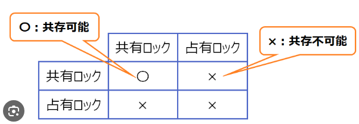
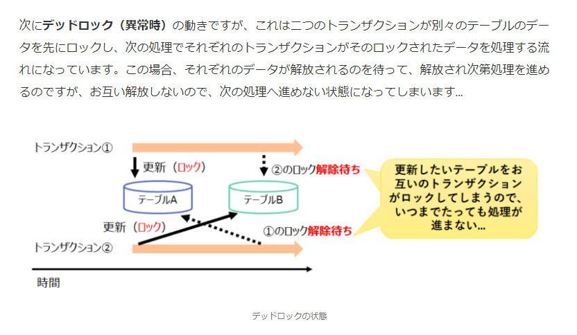
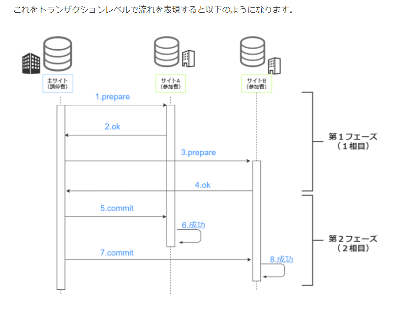

# データベース技術

## データベース

### データベース
- 一定の規則に従って関連性のあるデータを蓄積したもの

### データモデル
- データベースを設計する際に実世界におけるデータの集合をデータベース上で利用可能にするもの

#### 関係モデル
- データの関係を集合論などの数学モデルで表現したもの
- これをコンピュータに実装したのが関係データベース
- 対応表

| 関係モデル |           | 関係データベース     |
| :--------- | :-------- | -------------------- |
| 関係       | Relation  | 表・テーブル         |
| 属性       | Attribute | 列・項目・カラム     |
| タプル     | Tuple     | 行・レコード         |
| 定義域     | Domain    | 整数型、文字列型など |

#### 関係データベース
- 行と列から構成される２次元の表によって表現されるデータベース
- リレーショナルデータベース

### スキーマ
- データの形式、性質、ほかのデータとの関連などのデータ定義の集合
- 外部、概念、内部の３つのスキーマがあり、**3層スキーマ**と呼ばれている。
  - 外部スキーマ
    - 利用者やアプリケーションから見たデータベースの構造で概念スキーマから必要な部分を取り出して定義したもの
  - 概念スキーマ
    - 開発者から見たデータ項目やデータベースの構造（論理的構造）を定義したもの。表が相当する。
  - 内部スキーマ
    - データベースを記録媒体に、データを格納するための物理的な構造
- 3層に分けることでデータの物理的な格納構造を変更してもアプリケーションには影響が及ばない

### データベース管理システム
- DBMS:Data Base Management System
- 複数の利用者で大量のデータを共同利用できるよう管理するソフトウェア
- 次の機能がある
  - 保全機能
    - 参照制約や排他制御
    - データベースの完全性を保つ機能
  - 障害回復機能
    - ロールフォワードやロールバックなど、データベースの障害を回復する機能
  - 機密保護機能
    - ユーザ認証、アクセス制御など、データ改ざんや漏洩を未然に防ぐ機能

## データベース設計
### データベース設計
- DB設計では対象業務を分析するためにＥＲ図などが使われる

#### ER図
- Entity-Relationship Diagram
- 対象業務を構成する実体と実体間の関連を視覚的に表した図
- 実体をエンティティ、関連をリレーションシップと呼ぶ
  - 関連には種類ある
    - 1-1
    - 1-多
    - 多-1
    - 多-多
- [ER図に関する解説サイト。めちゃ分かりやすい！](https://www.ntt.com/business/sdpf/knowledge/archive_50.html)

### 表の設計
#### 主キー
- 表中の行を一意に識別するための列
- 重複していることはない
- 必須入力

#### 外部キー
- ほかの表の主キーを参照している列
- 関係する表間で参照一貫性が維持されるよう（矛盾が発生しないよう）制約される。**参照制約**

## データの正規化
### データの正規化
- 必要なデータ項目を整理して、データが重複しないように表を分割すること
- データの重複を排除することでデータベース操作に伴う重複更新や矛盾の発生を防ぐことが目的

- [解説サイト](https://www.foresight.jp/fe/column/normalization/)

- 複合主キー
  - 複数列を組み合わせることで行を一意にできる。
- 部分関数従属
  - 主キーの一部の項目によって、項目が一意に決まる関係
- 完全関数従属
  - 主キーによって項目が完全に一意に決まる関係
- 推移的関数従属
  - 主キー以外の項目によって項目が一意に決まる関係

## トランザクション処理
- データベース更新時に切り離すことができない一連の処理
- トランザクション処理には**ACID特性**という特性がある。
  - 原子性
    - Atomicity
    - トランザクション処理がすべて完了したか、まったく処理されていないかで終了すること
  - 一貫性
    - Consistency
    - データベースの内容に矛盾がないこと
  - 独立性
    - Isolation
    - 複数のトランザクションを同時に実行した場合と、順番に実行した場合との処理結果が一致すること
  - 耐久性
    - Durability
    - トランザクションが正常終了すると、更新結果は障害が発生してもデータベースから消失しないこと

### 排他制御
- データベース更新時にデータの不整合が発生しないように、データの更新中はアクセスを制御（ロック）して別のトランザクションからは更新できないよう制御すること

#### 共有ロックと専有ロック
- 共有ロック
  - トランザクションがデータを参照する前にかけるロック
- 専有ロック
  - トランザクションがデータを更新する前にかけるロック

#### ロックの粒度
- データ更新の際にロック粒度を大きくする（ロック範囲を広くする）と他のトランザクションの待ち状態が多く発生して全体のスループットが低下する

### デッドロック
- 複数のトランザクションが互いに相手が専有ロック知っている資源を要求して待ち状態になり、実行できなくなる状態
- めっちゃわかりやすい図解

### 二相コミットメント
- 分散型データベースシステムにおいて一連のトランザクション処理を行う複数サイトに更新処理が確定可能かどうかを問い合わせた後、すべてのサイトが確定可能であれば更新処理を確定する方式

- アクセス透過性
  - 使用する資源が遠隔地にあろうと手元にあろうと、利用者が意識することなく同じ処理方式でアクセスできること。

## データベースの障害回復
### ログファイル
- データベースには全データをバックアップしたフルバックアップファイルがある
- さらに、更新前後の記録があるログファイルもある。
  - ジャーナルファイルともいわれる

### データベースの障害回復
障害時のリカバリ手段には次のようなものがある。

#### ロールフォワード
- データベースのハードウェア障害に対してフルバックアップ時点の状態に復元した後、ログファイルの更新後情報を使用して復旧させる方法

#### ロールバック
- トランザクション処理プログラムがデータベースの更新途中に異常終了した場合に、ログファイルの更新前情報を使用して復旧させる方法

### チェックポイント
- 障害回復時に起点となるポイント
- [matome](https://marbou-work.com/fe-transaction/#%E3%83%88%E3%83%A9%E3%83%B3%E3%82%B6%E3%82%AF%E3%82%B7%E3%83%A7%E3%83%B3%E5%87%A6%E7%90%86%E3%81%AB%E9%96%A2%E3%81%99%E3%82%8B%E5%95%8F%E9%A1%8C%E4%BE%8B%E3%81%A8%E8%A7%A3%E8%AA%AC)

> システム障害時の対応
> - ウォームスタート
>   - システムの電源を切ることなくログの更新情報を使って処理を再開すること
> - コールドスタート
>   - システムの電源を入れなおし、システムを初期状態に戻してから処理を再開すること。

## データ操作とSQL
### 関係演算
- 関係データベースの表から目的のデータを取り出す演算
- 次のデータ操作がある
  - 射影
    - Projection
    - 表の中から特定の列を抽出する
  - 選択
    - Selection
    - 表の中から条件に合致した行を抽出する
  - 結合
    - Join
    - 二つ以上の表を結合して一つの表を生成する

### SQL
- データベースの表を定義したり、データを操作したりする言語
  - DDL(Data Definition Language)
    - データ定義言語
  - DML(Data Manipulation Language)
    - データ操作言語

### データ定義言語
#### 表の定義
スキップ
#### ビューの定義
- 実際に存在する実表から必要な部分を取り出して、一時的に作成した表

### データ操作言語
#### 射影
SELECT
#### 選択
WHERE
#### 結合
jOIN

## SQL(並べ替え・グループ化)
### 並べ替え
ORDER BY

### 集合関数
SUM,AVG,MAX,MIN,COUNT

### グループ化
GROUP BY
#### HAVING
グループに対して条件付けすることができる。

## SQL(副問い合わせ)
### 副問い合わせ
SELECTの条件式の中にさらにSELECTを組み込みいったん抽出した結果を条件として、再度抽出すること

- IN,NOT IN
- EXISTS,NOT EXISTS

## データベースの応用
### NoSQL
- SQLを使わないで操作するデータベース全般のこと
- 以下のような種類がある。

| 分類                 | 特徴                                                                              |
| :------------------- | :-------------------------------------------------------------------------------- |
| キーバリューストア型 | 保存したいデータと、そのデータを一意に識別できるキーを組みとして管理する。        |                  
| カラム指向型         | キーに対するカラムを自由に追加できる。                                            |                  
| ドキュメント指向型   | ドキュメント１件が一つのデータとなる。データ構造は自由。XMLなどでデータを記述する |                  
| グラフ指向型         | グラフ理論に基づきノード間を方向性のあるリレーションでつないで構造化する。        |                  

### データベースの応用
- データウェアハウス
  - 企業の様々な活動を通して得られた大量のデータを整理・統合して蓄積したデータベース。意思決定支援などに活用する。
- データレイク
  - 必要に応じて加工するために、データを発生したままの未処理の形でリアルタイムに蓄積するデータウェアハウスの一種
- データマート
  - 利用者が情報を利用するために、データウェアハウスから抽出した目的別のデータベース。あらかじめ集計処理などをしておくと、探索時間を短縮できる。
- データマイニング
  - 大量のデータを統計、数学的手法で分析し、新たな法則や因果関係を見つけ出すこと。
- BIツール
  - DWH,DMに蓄積された情報をデータマイニングなどで分析して経営判断上の有用な情報を取り出すツール

### ビッグデータ
- 多種多様で高頻度に更新される大量のデータ
- オープンデータ
  - 機械判読に適した形式で、原則無償で自由に２次利用できるというルールの下で、国や自治体、企業などが公開する官民データ

### データ資源の管理
- リポジトリ
- データディクショナリ

