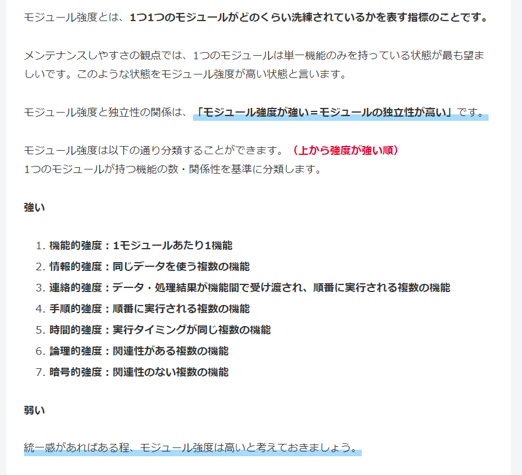
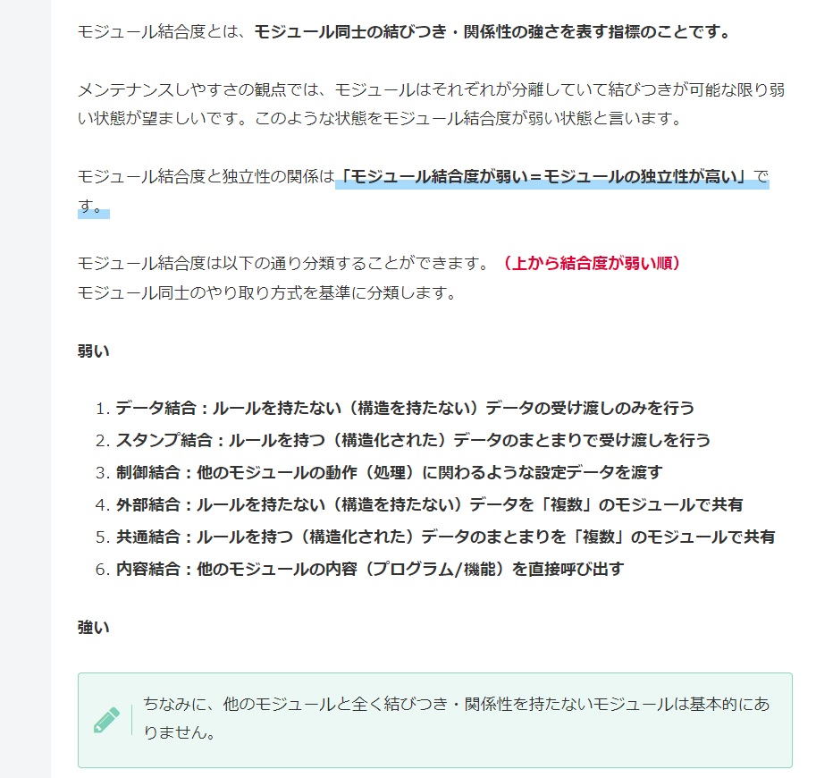
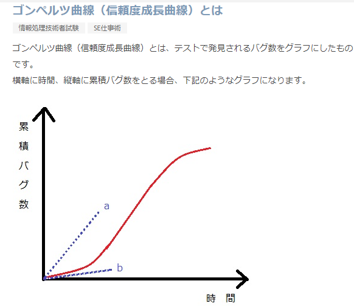
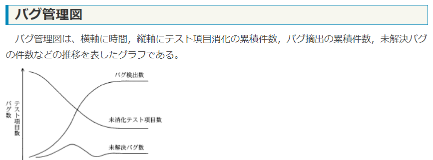
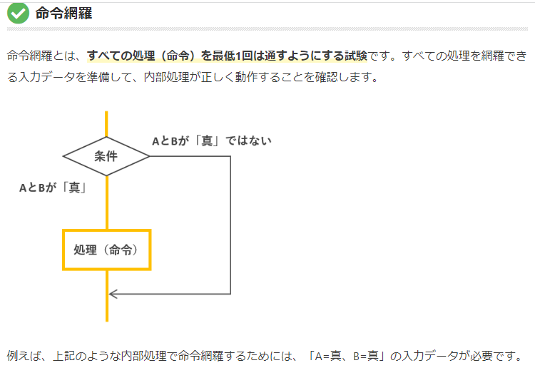
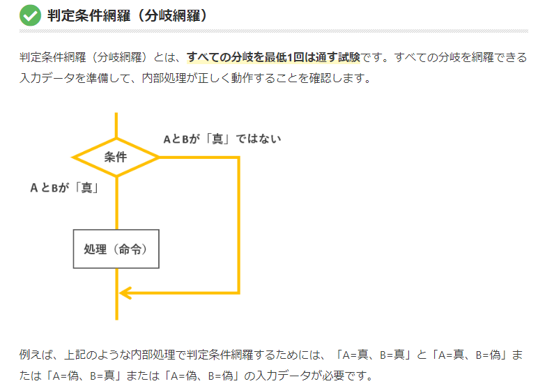
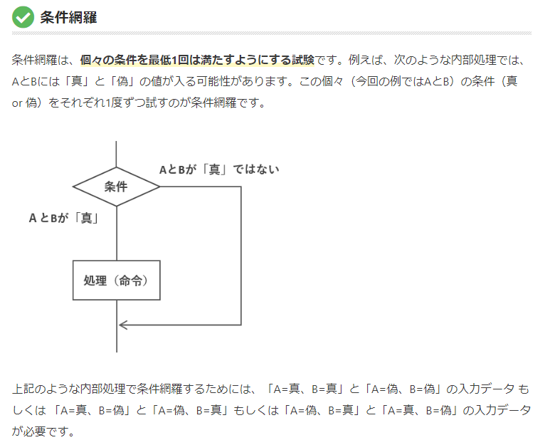
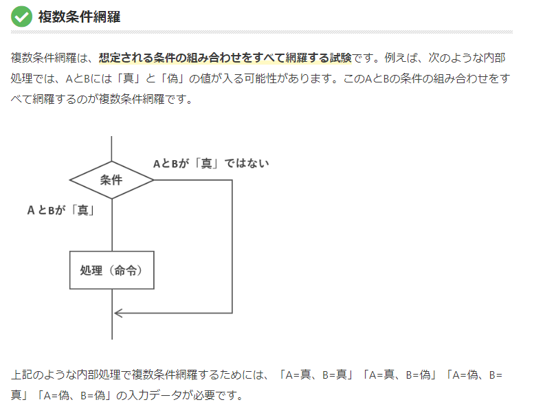

# システム開発技術

## 情報システム戦略とシステム企画

### 情報システム戦略
経営戦略に基づいて情報システム全体のあるべき姿を明確にする

#### 全体最適化計画
- 全社的な観点から情報システムのあるべき姿を明確にする計画

#### 情報システム管理基準
- 情報システムの管理を効果的に行うための実践規範を、経済産業省が体系的にまとめたもの

#### CIO
- Chief Information Officer
- 全社的な観点から情報戦略を立案し、経営戦略との整合性の確認、評価を行う投資

#### ITガバナンス
- 情報システム戦略の策定と実行をコントロールする組織の能力

### EA
- エンタープライズアーキテクチャ
- 全体最適化の観点から各業務と情報システムを見直すための技法
- AsIsとToBeとの差を分析（ギャップ分析）師ながら業務とシステムを同時に改善していく
- 次の4つの体系で分析して、全体最適化の観点から見直していく
  - ビジネスアーキテクチャ
    - 経営戦略に必要な実現すべき業務の姿を体系化するもの
  - データアーキテクチャ
    - 業務に必要なデータの内容やデータ間の関連性などを体系化するもの
  - アプリケーションアーキテクチャ
    - 業務処理に最適な情報システムの形態を体系化するもの
  - テクノロジアーキテクチャ
    - 情報システムの構築・運用に必要な技術的構成要素を体系的に示したもの

### 共通フレーム
- SLCP(Software Life Cycle Process)
- Software開発さあ行全般にわたって共通の物差しとなるガイドライン
  - 共通フレーム２０１３（SLCP-JCF-2013）とも呼ばれている
- 次のようなプロセスがある
  - 企画プロセス
  - 要件定義プロセス
  - システム開発プロセス
  - ソフトウェア実装プロセス
  - 保守プロセス
- 次項にて各プロセスを深堀していく
### 企画プロセス
企画プロセスでは、システム化構想やシステム化計画を立案する
#### システム化構想
- 経営事業の目的や目標を達成するために経営上のニーズと課題を確認し、経営戦略に基づいたシステム化の方針を立案すること
#### システム化計画
- システム化構想を実現する為に立案する計画

### 要件定義プロセス
- 利用者のニーズを整理し、新たに構築する業務とシステムの仕様や範囲を明らかにし、利害関係者間で合意するプロセス
1. 業務上実現すべき業務要件を整理、把握する。
2. その為に必要なシステムの機能である機能要件を定義する。
3. 併せて機能要件以外の性能や信頼性などの非機能要件を定義する

### 調達計画、実施
- システム化が決定すると、ベンダ企業を選定して契約を締結する
- その過程で様々な情報や書類をやり取りしていく

#### RFI
- 情報提供依頼
- Request For Information
- ベンダ企業に対してシステム化の目的や業務内容等を示して利用可能な技術製品、導入実績などの実現手段に関する情報提供を依頼すること

#### RFP
- 提案依頼書
- Request For Proposal
- ベンダ企業に対して対象システムや調達条件などを示し、提案書の提出を依頼する文書

#### 提案書
- ベンダ企業がRFPを元に開発体制やシステム構成、開発手段などを検討し提案する文章

#### 見積書
- ベンダ企業がシステムの開発や運用、保守などにかかる費用を提示する文書

#### NDA
- Non-Disclosure Agreement
- 秘密保持契約
- システム開発では再委託先も含め企業間でお互いに知り得た相手の機密情報の守秘義務について、秘密保持契約を結んでおくことが重要

#### CSR
- Corporate Social Responsibility
- 起業が本来の営利活動とは別に社会の一員として社会的責任を果たすこと

## ソフトウェア開発

### ソフトウェア開発工程
- ソフトウェア開発では開発者が利用者の要件を取り入れながら次のような各工程を順番に実施していく。
- 各工程で作成されたドキュメントは次の工程へと引き継がれていく

#### 工程
下に行くにつれて下流になる

- システム要件定義
  - 開発者が利用者にヒアリングしてシステム化する目的や対象範囲を明確にし、システムに必要な機能や性能などを定義する。
- ソフトウェア要件定義
  - 開発者が利用者にヒアリングして利用者の視点からソフトウェアに要求される機能や性能などを検討する。
- システム設計
  - 開発者の視点からシステム要件をシステムでどのように実現できるかを検討する
- ソフトウェア設計
  - 開発者視点からソフトウェア要件をソフトウェアでどのように実現できるかを検討する。
- 実装・構築
  - プログラム作成
- テスト

### ソフトウェア開発手法
#### ウォーターフォールモデル
- 上流から下流に順番に進めていく開発手法

#### アジャイル開発
- 短い開発工程を何度も繰り返し利用者のニーズを随時取り入れながら迅速かつ段階的に完成度を高めていく開発手法

#### XP
- eXtreme Programming
- アジャイル開発の手法な一つで次のような実践が提唱されている。
- イテレーションと呼ばれる短いサイクルで動作するプログラムを作成することを繰り返す。
- 二人一組でプログラミングをする
- 保守性を高める為にリリース済みコードでも改善を繰り返す。（リファクタリング）
- テストケースを先に作ってからプログラムを作成する（テストファースト）
- 結合、テストを繰り返す（継続的インテグレーション）

#### スクラム開発
アジャイルの一つ
- スプリントと呼ばれる動作するプログラムを作成する。
- 優先順位の高い機能から作成する
- 毎日のミーティングを行う。（デイリースクラム）
- レトロスペクティブ
  - 振り返り。改善事項を検討する。

#### プロトタイピングモデル
- システム開発のか早い段階から試作品を作成して利用者の確認を得ながら開発を進めていく開発手法

#### スパイラルモデル
- システムをさらに独立性の高いサブシステムに分割しサブシステム毎に要件定義や設計、開発、テストを繰り返しながら段階的にシステムを完成させていく開発手法

#### リバースエンジニアリング
- 既存のプログラムを解析してプログラムの仕様と設計書を取り出す開発手法

### DevOps
- 開発部門と運用部門が連携して協力する開発手法

#### CMMI
- Capability Model Integration
- システム開発組織におけるプロセス成熟度を評価するモデル
- 統合能力成熟度モデルと訳される

## オブジェクト指向

### オブジェクト指向設計
- オブジェクト指向設計はオブジェクト単位にシステムを設計する方式

#### オブジェクト
- オブジェクトはデータとそれを操作するメソッドを一体化したもの

#### カプセル化
- カプセル化はオブジェクト内にあるデータとメソッドをオブジェクトの外部から隠ぺいすること
- private
- オブジェクトに対して唯一できる手段がメッセージを送ること（直接アクセス禁止）

### クラスとインスタンス
#### クラス
- データとメソッドを持ったオブジェクトのひな型を定義したもの

#### インスタンス
- クラスを元にして生成されたオブジェクト
- 実際に処理する場合はクラスの定義に基づいてインスタンスを生成する。

### 継承とポリモフィズム
- オブジェクト指向では既存クラスを基にして新しいクラスを生成することができる。
- 基となるクラスをスーパークラス
- 新しく生成したクラスをサブクラス

#### 継承
- 継承（インヘリタンス）はスーパークラスで定義しているデータやメソッドをサブクラスに引き継ぐこと。
- 継承することにより、サブクラスではスーパークラスとの差異を定義するだけで済む

#### ポリモフィズム
- オーバーライドはスーパークラスで定義されたメソッドをそのまま継承するのではなく、サブクラスで再定義することで動作を変更すること
- 同一のメッセージを送っても、特有の動きを行うことができる
  - これをポリモフィズム(多相性、多様性）と呼ばれている。

### クラスの階層化
- クラスを階層化したとき、上位クラスと下位クラスには、次のような「汎化ー特化」「集約ー分解」の関係がある。
#### 汎化（抽象化）ー特化
- 汎化
  - 下位クラスの共通部分を抽出して上位クラスを定義すること
- 特化
  - 汎化の逆
- スーパークラスとサブクラスには「汎化ー特化」の関係にある

#### 集約ー分解
- 集約
  - 上位クラスが下位クラスの組み合わせで構成されていること
- 分解
  - 集約の逆
- 集約ー分解には下位クラス is part of 上位クラスの関係がある
  - 例えばアクセルは自動車の一部である、ブレーキは自動車の一部である。これがpart of の関係にある

## 業務モデリング
### 業務モデリング
- 企業などにおける業務の一連の流れを業務プロセス（ビジネスプロセス）と呼ばれている
- BPR
  - Business Process Re-engineering
  - 業務プロセスを再設計し、情報技術を十分に活用して企業の体質や構造を抜本的に変革すること
- BPM
  - BusinessProcess Management
  - 業務プロセスをPDCAサイクルで継続的に改善していく管理手法

### DFD(Data Flow Diagram)
- 業務プロセス中のデータの流れをモデル化したもの

### UML
- Unified Modeling Language
- オブジェクト指向におけるシステム開発で利用され、分析から設計・実装・テストまでを統一した表記法でモデル化したもの
#### ユースケース図
- システムが外部に提供する機能と、その利用者が外部システムとの関係を表現した図
- 外部に提供する機能はユースケースと呼ばれる。楕円でシステム境界の内部に記載する。
- 利用者や外部システムはアクターと呼ばれる。人型で記述される

#### オブジェクト図
- インスタンス間の関係を表現した図

#### クラス図
- クラス間の関係を表現した図

#### アクティビティ図
- ある振る舞いから次のふるまいへの制御の流れを表現した図

#### コミュニケーション図
- オブジェクト間で送受信されるメッセージを表した図。オブジェクト同士の関係の観点からメッセージを表現する。

#### シーケンス図
- オブジェクト間で送受信されるメッセージを表した図
- 時系列の観点からメッセージを表現する。
- > 使うことある。

## ヒューマンインターフェース
### ヒューマンインターフェース
- ソフトウェアの操作画面などの利用者とコンピュータとの接点の事。

### 画面設計・帳票設計
#### 画面設計の留意点
- 関連する入力項目は隣接するように配置する。
- カーソルは画面の左から右へ、上から下へ移動するように配置する。
などなど

#### GUI
省略

#### シグニファイア
- 物体に対してできることを示す手がかり
- Webサイト上の文字で青い色で示され下線がついていたりする奴

### 入力チェック
入力データのチェック方式には次のようなものがある。
- ニューメリックチェック
  - 数値として扱う必要があるデータに文字などの数値として扱えないものが含まれていないかとどうかを検査する
- シーケンスチェック
  - データが昇順や降順など決められた順番に並んでいるかどうかを検査する
- 重複チェック
  - 重複したデータが存在しないかどうかを検査する
- フォーマットチェック
  - データが決められた形式にあっているかどうかを検査する。
- 論理チェック
  - データが論理的に矛盾しないかどうかを検査する
- リミットチェック
  - データの値が一定の範囲内にあるかどうかを検査する
- 照合チェック
  - データがファイルに存在するかどうかを検査する

#### チェックディジット検査
- 入力データの数値から一定の規則に従って検査文字を求め、検査文字を入力データの末尾に不可することで入力データに誤りがないかどうかを検査する方法

### ユニバーサルデザイン
- 国籍や年齢、性別、身体的条件等にかかわらず、だれもが使える設計。
次の概念がある。
  - アクセシビリティ
    - 年齢や身体的条件などに関わらず、だれもが情報サービスを支障なく操作または利用される度合い。
  - ユーザビリティ
    - 利用者がどれだけストレスを感じずに目標とする要求が達成できる度合い。

#### UX
- 使いやすさや機能にとどまらず、使うことで利用者が楽しく快適な体験ができるかどうかまでを含んだ概念

## モジュール分割
### 構造化設計
- システムの機能に着目して、ソフトウェア開発の上位レベルの大きな昨日から段階的に詳細化していく設計手法
ソフトウェア開発の各工程では次のように詳細化していく。
  - システム設計
    - システムをサブシステム（機能）に分割する
  - ソフトウェア要素の設計
    - サブシステムをコンポーネント（ソフトウェア要素）に分割する。コンポーネントはある機能を実現するために部品化されたプログラム
  - モジュールの設計
    - コンポーネントをモジュール（ソフトウェアユニット）に分割する。モジュールはプログラムを構成する最小単位

### モジュール分割
- 構造化設計ではモジュールの独立性が高くなるように設計する。
モジュールの独立性が高いことはあるモジュールを変更したとしても他のモジュールへの影響が低いことを言います。

#### モジュール強度

#### モジュール結合度

#### レビュー
- 設計の品質評価を行い仕様の不備や誤りを早期に発見して後戻りの工数削減を図る。
- 責任追及や人事評価に利用したりすることのないようする。
次のようなレビューがある
  - ラウンドロビン
    - 参加者全員が持ち回りでテーマごとに進行役となる。
  - ウォークスルー
    - 作成者が説明者となり、複数の関係者が質問やコメントをする検討会
  - インスペクション
    - 参加者の役割や進行役を固定

## テスト手法
### プログラムテスト
- プログラム内に潜む誤りをバグという。
- バグを発見し、取り除くことが目的
- その為に、エラーを発見できるようなテストケースを想定する必要がある.

### テスト工程
- テストケース
  - テスト項目の条件分けや、その条件ごとに期待される動きをまとめたもの

### ソフトウェアユニットテスト
- 単体テストの事
- プログラムを構成するモジュール単位に行うテスト
- 次の種類に分かれる

#### ホワイトボックステスト
- モジュールの内部構造に着目して行うテスト
- 次のようのなテストケース設計手法がある
  - 命令網羅
    - 
  - 分岐網羅
    - 
  - 条件網羅
    - 
  - 複数条件網羅
    - 

#### ブラックボックステスト
- モジュールの外部仕様に着目して行うテスト
- 次のようなテストケース設計技法がある。
  - 境界値分析
  - 同値分割
    - 有効値と無効値のクラスに分け、それぞれのクラスの代表的な値をテストケースとする

### ソフトウェア統合テスト