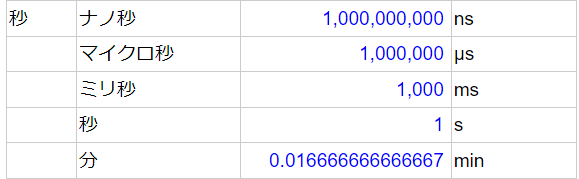
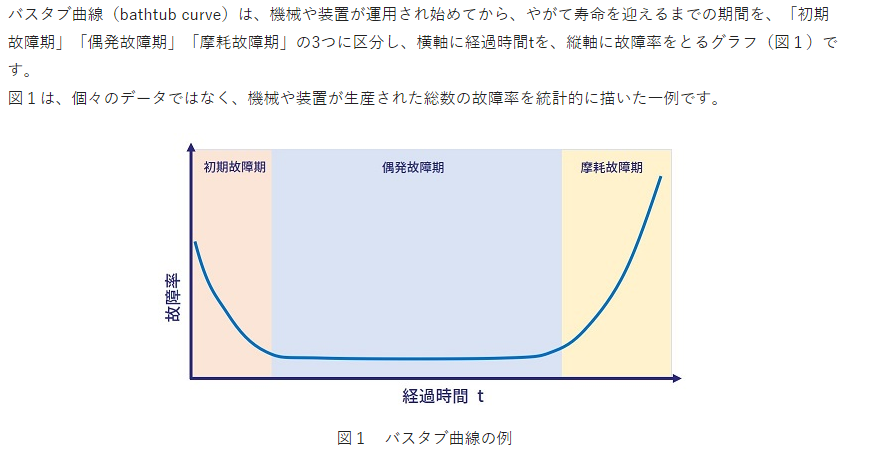

# システム構成
- [システム構成](#システム構成)
  - [システム構成](#システム構成-1)
    - [システム構成](#システム構成-2)
    - [デュプレックスシステム](#デュプレックスシステム)
      - [ホットスタンバイ](#ホットスタンバイ)
      - [コールドスタンバイ](#コールドスタンバイ)
    - [システムの処理形態](#システムの処理形態)
    - [バックアップサイト](#バックアップサイト)
    - [緊急事態の行動計画](#緊急事態の行動計画)
    - [デュアルシステム](#デュアルシステム)
    - [クラスタシステム](#クラスタシステム)
      - [HAクラスタ](#haクラスタ)
      - [HPCクラスタ](#hpcクラスタ)
      - [データベースのディスク共有](#データベースのディスク共有)
    - [グリッドコンピューティング](#グリッドコンピューティング)
  - [クライアントサーバシステム](#クライアントサーバシステム)
    - [集中処理と分散処理](#集中処理と分散処理)
    - [クライアントサーバシステム](#クライアントサーバシステム-1)
      - [３層クライアントサーバシステム](#３層クライアントサーバシステム)
      - [ストアドプロシージャ](#ストアドプロシージャ)
    - [サーバの仮想化](#サーバの仮想化)
      - [仮想化の形態](#仮想化の形態)
    - [シンクライアントシステム](#シンクライアントシステム)
      - [VDI](#vdi)
  - [RAIDと信頼性設計](#raidと信頼性設計)
    - [RAID](#raid)
    - [信頼性設計](#信頼性設計)
      - [フォールトアボイダンス](#フォールトアボイダンス)
      - [フォールトトレランス](#フォールトトレランス)
      - [フェールセーフ](#フェールセーフ)
      - [フェールソフト](#フェールソフト)
      - [フールプルーフ](#フールプルーフ)
  - [システムの性能評価](#システムの性能評価)
    - [システムの性能指標](#システムの性能指標)
      - [ベンチマークテスト](#ベンチマークテスト)
    - [MIPS](#mips)
      - [命令ミックス](#命令ミックス)
  - [システムの信頼性評価](#システムの信頼性評価)
    - [システムの評価特性](#システムの評価特性)
    - [システムの評価指標](#システムの評価指標)
      - [MTBF](#mtbf)
      - [MTTR](#mttr)
      - [稼働率](#稼働率)
    - [複数システムの稼働率](#複数システムの稼働率)
      - [直列システムの稼働率](#直列システムの稼働率)
      - [並列システムの稼働率](#並列システムの稼働率)
    - [バスタブ曲線](#バスタブ曲線)

## システム構成

### システム構成
- ミッションクリティカルシステム
  - 業務を遂行する上で不可欠なシステム
  - 停止すると社会に深刻なダメージを及ぼすシステム

これらのシステムは冗長構成、負荷分散したりするなどその目的に合ったシステム構成を考える必要があります。

### デュプレックスシステム
- 現用系と待機系の２系統のシステムで構成される。
- 現用系に障害が生じたときには待機系に切り替えて処理を続行する形態

#### ホットスタンバイ
- 待機系をいつでも動作できるような状態で待機させる。
- 障害発生時には直ちに切り替える形態

#### コールドスタンバイ
- 待機系を準備し、障害発生時には待機系を起動して切り替える形態

### システムの処理形態
- バッチ処理
  - データを一定期間または一定量を貯めてからまとめて処理をする形態
- オンラインリアルタイム処理
  - データの発生と同時に処理をする形態

### バックアップサイト
- ホットサイト
  - バックアップサイトには現用系と同じ構成で稼働させておき、データやプログラムもネットワークを介して常に更新を行う形態
- ウォームサイト
  - バックアップサイトにはハードウェアを準備して、データやプログラムは定期的に搬入しておく形態
- コールドサイト
  - バックアップサイトのみを確保しておく形態

### 緊急事態の行動計画
- BCP
  - Business Continuty Plan
  - 災害やシステム障害などの緊急事態に備え、事前に決めておく行動計画
- RTO
  - Recovery Time Objective
  - 事業中断から復旧までの目標復旧時間
- BCM
  - Business Continuty Management
  - BCPをPDCAで継続的に維持向上を図るマネジメント活動

### デュアルシステム
- ２系統で同じ処理を行い照合、障害発生時は片方で処理を続行

### クラスタシステム
- 複数のサーバをあたかも１台のサーバのように見せかける技術

#### HAクラスタ
- High Availability Cluster
- 可用性を高めることで高信頼化を目的とするシステム構成
- 大きく次の２つに大別される
  - 負荷分散型クラスタ
    - 同じ機能の複数サーバを並列稼働させる。各サーバに振り分けて負荷分散する。
  - フェールオーバー型クラスタ
    - 同じ機能の複数サーバを現用系と予備系の２系統に分けて稼働させる。現用系の障害時には自動で予備系に切り替わる

#### HPCクラスタ
- High Performance Computing Cluster
- 高性能化を目的とするシステム構成
- 複数サーバの演算処理を連携させて高い演算能力を引き出すことができる。  

#### データベースのディスク共有
- データベースをクラスタで分散させる場合はデータの整合性をとる必要がある。
- 負荷分散型クラスタではサーバそれぞれにデータを持ち、**レプリケーション**（迅速な複製）で整合性をとる。
- フェールオーバー型クラスタでは二つの方式がある。
  - 現用系サーバと予備系サーバが一つのディスクを共有する共有ディスク方式
  - 現用系のサーバのディスクに書き込まれたデータを予備系のサーバに同時にミラーリングして同期するミラーディスク方式

### グリッドコンピューティング
ネットワークを介して複数のコンピュータを連携させることで仮想的に１台の巨大で高性能なコンピュータを作る技術

## クライアントサーバシステム
### 集中処理と分散処理
- 集中処理
  - １台の高性能なホストコンピュータにデータや処理を集中させる
    - 昔に流行った
- 分散処理
  - 多くのコンピュータをネットワークで接続して、データや処理を分散させる

### クライアントサーバシステム
- クライアントとサーバでデータや処理を分散させる分散処理
- サービスを要求するクライアントとサービスを提供するサーバで構成する
- 一つのサーバに複数機能を持たせたり、１機能を複数サーバに分散させることも可能
- 必要に応じて処理の一部を別のサーバに要求するクライアント機能を持つこともできる。

#### ３層クライアントサーバシステム
- 論理的にプレゼンテーション層、ファンクション層、データベース層の３層構造に分離したアーキテクチャ
- ３層にすることで階層ごとに並行して開発できる。
- 最近ではWebサーバに加えてAPサーバを用いることがある。

#### ストアドプロシージャ
スキップ

### サーバの仮想化
１台の物理サーバ上で複数の仮想的なサーバを動作させたり、複数の物理的なマシンを一つのサーバとして扱ったりするための技術

#### 仮想化の形態
- ホスト型
  - ホストOS上で仮想化ソフトウェアを動作させ、その上で複数のゲストOSを動かす。仮想化環境を構築しやすい
- ハイパーバイザ型
  - 物理サーバ上でハイパーバイザという仮想化ソフトウェアを動作させ、そのうえで複数のゲストOSを動かす。クラウドサービスで採用されており、自由度は高いが別のマシンに移行しにくい
- コンテナ型
  - ホストOS上にコンテナエンジンという管理ソフトウェアを動作させ、そのうえでコンテナと呼ばれる実行環境を動かす。OSは共通のため自由度は低いが移行しやすい

> - ライブマイグレーション
> サーバの仮想化技術においてある物理サーバで稼働している仮想サーバを停止することなく別の物理サーバに移動させる技術

> - システムの処理能力向上
>   - スケールアップ
>     - 個々のサーバのCPUやメモリを増設すること
>   - スケールアウト
>     - サーバの台数を増やして、処理能力を向上させること。分散処理を行っているシステムではスケールアウトが適している。

### シンクライアントシステム
- サーバ上でアプリケーションやデータを集中管理することでクライアント端末には必要最低限の機能しか持たせないシステム
  - Thin->薄い
#### VDI
- Virtual Desktop Infrastructure
- クライアント端末のデスクトップ環境を仮想化されたサーバ上に集約してサーバ上で稼働させる仕組み

> NAS
> - Network Attached Storage はLANに直接接続して使用するファイルサーバ専用機
> - 異なるOS間でファイル単位に共有することが可能

## RAIDと信頼性設計
### RAID
- Redundant Arrays of Inexpensive Disks
- 複数の磁気ディスクを組合せ、１台の仮想的な磁気ディスクとして扱うことでアクセスの高速化や高信頼性を実現する技術
- パリティ
  - 磁気ディスクが故障したときにデータを修復するための情報

- RAID一覧

| RAID種別 | 説明                                                                                                                                                                              |
| :------- | :-------------------------------------------------------------------------------------------------------------------------------------------------------------------------------- |
| RAID0    | データをブロック単位に複数の磁気ディスクに分散して書き込む（ストライピング）アクセスを並列的に行うことで高速化が図れる。                                                          |
| RAID1    | 磁気ディスク２台に同じデータを書き込む（ミラーリング）信頼性が高いが、使用効率が低い                                                                                              |
| RAID3    | データをビット／バイト単位に複数の磁気ディスクに分散して書き込む。さらに１台の磁気ディスクにパリティを書き込む。１台が故障しても残ったデータとパリティからデータを復旧できる。    |
| RAID5    | データをブロック単位に複数の磁気ディスクに分散して書き込む。さらに、複数の磁気ディスクにパリティを分散して書き込む。1台が故障しても残ったデータとパリティからデータを復旧できる。 |

### 信頼性設計
システムの信頼性を向上させる設計手法には次のようなものがある。

#### フォールトアボイダンス
- 構成要素の信頼性を高め、故障そのものを回避する設計。

#### フォールトトレランス
- 構成要素を冗長化し、故障が発生しても必要な機能は維持する設計。
- フォールトトレラントシステム
  - システムが部分的に故障してもシステム全体としては必要な機能を維持するシステム

#### フェールセーフ
- システムの１部が故障しても危険が生じないような構造や仕組みを導入する設計。

#### フェールソフト
- 故障が発生した場合、１部のサービスレベルを低下させても稼働を継続する設計
- 縮退運転
  - システムを部分的に停止させた状態で稼働を続けること

#### フールプルーフ
- 人が誤った操作や取り扱いができないような構造や仕組みをシステムに組み込む設計

- エラープルーフ
  - どんなに注意していてもヒューマンエラーは100％は防げないが、いろいろ改善はできるよねっていう考え方
  - 排除
    - エラーの原因になるようなものを除去する
  - 代替化
    - 人が行っていた作業をシステム化
  - 容易化
    - 複雑な作業を簡単にする。
  - 異常検出
    - ほかに波及しないように異常を検出したら知らせる
  - 影響緩和
    - ミスの影響範囲が最小限になるようにする。

## システムの性能評価
### システムの性能指標
- スループット
  - 単位時間あたりに処理される仕事量。単位時間当たりに処理できる件数が多いほどシステム性能が高いとされている。
- ターンアラウンドタイム  
  - 利用者が処理を依頼してから結果の出力が終了するまでの時間。この時間が短いほどシステムの性能が高いといえる。主にバッチ処理で使われる指標
- レスポンスタイム
  - 利用者が処理を依頼してから端末に処理結果が出始めるまでの時間。応答時間ともいう。この時間が短いほどシステムの性能が高いといえる。主にオンラインリアルタイム処理で使われる指標

#### ベンチマークテスト
- システムの使用目的に合った標準的なプログラムを実行させ、その測定数値から処理性能を相対的に評価する方法
> 以下のようなテストがある。

- SPECint
  - 整数演算の性能を測定するベンチマークテスト
- SPECfp
  - 浮動小数点演算の性能を測定するベンチマークテスト
- TPCベンチマーク
  - トランザクション処理の性能を測定するベンチマークテスト
  - CPUの性能だけでなく、磁気ディスクの入出力やDBMSの性能までを含め評価する。

### MIPS
- Million Instructions Per Second
- 1秒間に実行される命令数を百万単位で表したもの
- 主に同一アーキテクチャのCPU性能比較に用いられる。

#### 命令ミックス
- よく使われる命令をピックアップしてセットにしたもの
- CPUの命令には種類化があり、それぞれ実行速度も異なる。
- それぞれの命令の実行速度と出現頻度から加重平均を求め、MIPS値で表せば正確な指標となる。

次の命令ミックスの場合のMIPS値を求めてみよう

| 命令種別     | 実行速度（マイクロ秒） | 出現頻度（％） |
| :----------- | :--------------------- | -------------- |
| 整数演算命令 | 1.0                    | 50             |
| 移動命令     | 5.0                    | 30             |
| 分岐命令     | 5.0                    | 20             |

- 各命令の実行速度と出現頻度が異なるため、加重平均を使って１命令当たりの平均命令実行時間を求める。
- $1.0\times0.5+5.0\times0.3+5.0\times0.2=3.0マイクロ秒$
- これをMIPS値で表す。MIPSは１秒間に実行される命令数を100万単位で表したもの
- 100万は指数で表すと$10^6$
- 時間単位の整理

> たすき掛け
> - MIPS値の計算はたすき掛けなるものを使って求めるとGOOD
> $$
\begin{align}
  &\\
  &1\times1=3.0(平均命令実行時間)\times10^{-6}\times x(解)\\
  &x=1\div(3.0\times10^{-6})\\
  &x=1000000\div3 ←１秒をマイクロ秒にする。\\
  &x=約0.3MIPS(333,333.333....)
\end{align}
> $$
> - 平均命令実行時間の単位に１秒を合わせると割り算一発で済む。(1秒=100万マイクロ秒)

- [まとめ](https://it.sumahotektek.com/it-mips/#toc3)

## システムの信頼性評価
### システムの評価特性
システムの評価特性には**RASIS**という５つの以下の指標がある。

| 特性   | 説明                                                                                                                  |
| :----- | :-------------------------------------------------------------------------------------------------------------------- |
| 信頼性 | Reliability.要求された機能を、規定された期間実行する特性。正常に稼働していること。指標としてMTBFが用いられる。        |
| 可用性 | Availability.要求されたサービスを提供し続ける特性。使いたいときにいつでも使えること。指標として、稼働率が用いられる。 |
| 保守性 | Serviceability.故障時に容易に修理できる特性。故障時に復旧しやすいこと。指標として、MTTRが用いられる。                 |
| 保全生 | Integrity.情報の一貫性を確保する特性。データに矛盾がないこと                                                          |
| 安全性 | Security.情報漏洩や紛失、不正使用を防止する特性。機密性が高いこと。                                                   |

### システムの評価指標
特性を具体的な数値で評価する指標には次のものがある。

#### MTBF
- Mean Time Between Failures
- 平均故障間隔
- システムが故障してから次に故障するまでの平均時間
- 正常に稼働している期間の平均時間
- この値が大きいほど信頼性が高いシステムといえる。

#### MTTR
- Mean Time To Repair
- 平均修理時間
- システムが故障して修理に要する平均時間
- この値が小さいほど保守性が高いシステムだといえる。

#### 稼働率
- システムが正常に動作している時間の割合。↓の公式で求められる
$$
稼働率=\frac{MTBF}{MTBF+MTTR}
$$
### 複数システムの稼働率
複数の要素で構成されているシステムについて考えてみよう

#### 直列システムの稼働率
- システムAとBが直列で接続されている場合、一方のシステムが稼働しなくなるともう一方のシステムも稼働しなくなる。
- システム全体が稼働するのはAB両方とも稼働しているときのみ。
- 直列システムの稼働率は$システムAの稼働率\timesシステムBの稼働率$で求めることができる。

#### 並列システムの稼働率
- システムABが並列で接続されている場合は、一方のシステムが稼働しなくてももう一方のシステムは稼働している。
- システム全体が稼働するのはABどちらかでも稼働しているとき
- 並列システムの稼働率は
$$
1-(1-システムAの稼働率)(1-システムBの稼働率)
$$
- 式の仕組みを分解
  1. (1-a)
     - システムAが故障している確率 
  2. (1-b)
     - システムBが故障している確率 
  3. (1-a)(1-b)
     - AとB両方が故障している確率
  4. 1- (1-a)(1-b)
     - AとB両方が故障していない確率
     - ABどちらか一方が稼働している確率

### バスタブ曲線
各装置の故障率と時間の関係をグラフにするとバスタブのような形になる。
- グラフの部分（期間）に名前がついてる。

- 初期故障期間
  - 初期導入時には設計や製造の誤りなどにより故障率が高くなる
- 偶発故障期間
  - 初期故障の誤りを修正し、故障率がほぼ一定になる。
- 摩耗故障期間
  - 時間が経つにつれ、摩耗などににより故障率が高くなる。

