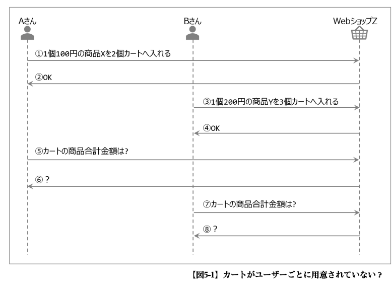
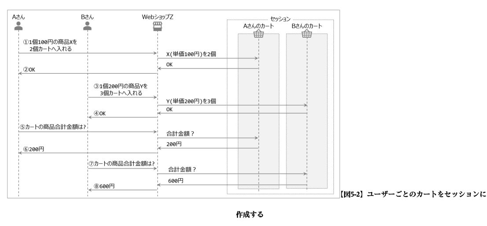
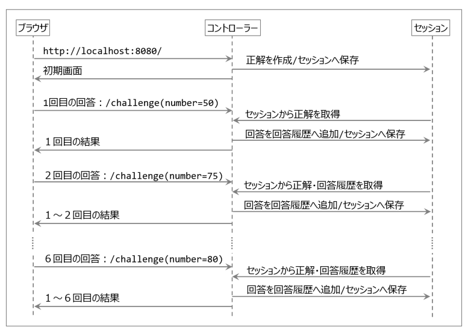

# springのメモリスト

- [springのメモリスト](#springのメモリスト)
  - [ディレクトリ構成](#ディレクトリ構成)
  - [よく使う？アノテーション](#よく使うアノテーション)
    - [@RestController](#restcontroller)
    - [@GetMapping](#getmapping)
    - [@RequestParam](#requestparam)
    - [@PathVariable](#pathvariable)
    - [@PostMapping](#postmapping)
    - [@Data](#data)
    - [@ModelAttribute](#modelattribute)
  - [Thymeleaf](#thymeleaf)
  - [セッション操作](#セッション操作)
    - [セッションの必要性](#セッションの必要性)
    - [数当てゲームでセッションを学ぶ](#数当てゲームでセッションを学ぶ)

## ディレクトリ構成
- src/main/resources
  - static
    - CSSとか、内容が変化しな静的なファイルを格納するフォルダ
  - templates
    - 処理結果画面など、内容が動的に変化するファイルを格納するフォルダ
  - application.properties
    - DB接続情報など、プロジェクト全般にかかわる設定情報を記述するファイル。

## よく使う？アノテーション

### @RestController
- 「コントローラー クラス の メソッド で 処理 し た 結果 を、 そのまま レスポンス として ブラウザ へ 送信 する」 こと を 表す アノテーション
- 本来はJSON、XMLなどを返す「RESTインターフェース」で使う。
- テキストを返す機能としても流用できる。

### @GetMapping
- GETリクエストに対応するメソッドであることを示すアノテーション
- GETリクエストはサーバーへリクエストを送る方法の一つ。(例：http://localhost:8080/hello でサーバーにGETリクエストが送信される。)
- このアノテーションがついたメソッドの引数には処理対象とする「URLのパス名」を書くことで、対象のGETリクエストが送られてきたら自動的に呼び出される。
```java
	@GetMapping("/hello")
	public String sayHello() {
		return "みなさん　こんにちは!";
	}

// 引数{name}はURLパスから値として取り出す部分を指定するもの「URIテンプレート変数」
// ※この場合、URLパスが/hello3/Jamesなら、nameという名前で"James"を取り出す。
  @GetMapping("/hello/{name}")
	public String sayHello(@PathVariable("name")String name) {
		return "Hello, world!" + "こんにちは" + name + "さん！";
	}
```

### @RequestParam
- 引数で指定されたパラメータの値を、メソッド実行前にクエリ文字列から取得し、メソッド引数へセット（バインド）する。
- 引数はクエリ文字列のパラメータ名と一致させる必要がある。
```java
@RestController
public class Hello2Controller {
	@GetMapping("hello2")
	public String sayhello(@RequestParam("name") String name) {
		return "Hello World!" + "こんにちは" + name + "さん！";
	}
  // パラメータが複数ある時はその分メソッド引数を追加する。
  public String sayhello(@RequestParam("name") String name, @RequestParam("age") int age) {
  }
    // バインドさ荒れる引数名と@RequestParamの名称が同一の場合、アノテーションの記載は省略可能
  public String sayhello(@RequestParam("name") String name, @RequestParam("age") int age) {
  }
  ↓
  public String sayhello(String name, int age) {
  }
}
```

### @PathVariable
- URIテンプレート変数の値をメソッド引数にセット（バインド）する。
- PathVariableの値はURIテンプレート変数名と一致させる必要がある。
```java
	@GetMapping("/hello/{name}")
	public String sayHello(@PathVariable("name")String name) {
		return "Hello, world!" + "こんにちは" + name + "さん！";
	}
```

> Submitボタンは自分が属しているform要素に入力された内容をクエリ文字列形式にしてサーバーへ送信します

### @PostMapping
- POSTリクエストを処理するメソッドということを表す。
- フォームに入力された値はGETと同じくクエリ文字列形式（パラメータ名＝パラメータ値）の為、@RequestParamで受け取る
```java
	@PostMapping("hello4")
	public String sayHello(@RequestParam("name")String name) {
		return "Hello, world!" + "こんにちは" + name + "さん";
	}
```

### @Data
- Lombokのアノテーション
- このアノテーションを付与すると、デフォルトコンストラクタ、toString,gettersetterのメソッドを自動生成してくれる。
- このアノテーションが付与されるクラスはSpringでは主にフォームクラス（HTMLのフォーム属性の内容を保持するクラス）で使用される。
```java
package com.example.demo;

import lombok.Data;

@Data
public class RegistData {
	private String name;
	private String password;
	private int gender;
	private int area;
	private int[] interest;
	private String remarks;
}
```

> @Data でクラスをアノテートすると、以下のアノテーションを全て設定したのと同じ効果を得られる。
@ToString
@Getter
@Setter
@RequiredArgsConstructor
@EqualsAndHashCode
とりあえずdataでよさげ？
### @ModelAttribute
- フォーム部品のname属性値とフォームクラス（HTMLのフォーム属性の内容を保持するクラス）のプロパティ名（フィールド名）をキーにして、フォーム部品の値がフォームオブジェクトにバインドされる。
- これによりフォーム部品ごとにRequestParamを付与した引数を並べる必要がないのでシンプルなコードになるメリットがある。
```java
@RestController
public class Registration2Controller {
	@PostMapping("/register")
	public ModelAndView register(@ModelAttribute RegistData registData, ModelAndView mv) {
		StringBuilder sb = new StringBuilder();
		sb.append("名前："+registData.getName());
		sb.append(",パスワード："+registData.getPassword());
		sb.append(",性別："+registData.getGender());
		sb.append(",地域："+registData.getArea());
		sb.append(",興味のある分野："+Arrays.toString(registData.getInterest()));
		sb.append(",備考："+registData.getRemarks().replaceAll("\n",""));
		mv.setViewName("result");
		mv.addObject("registData", sb.toString());
		return mv;
	}
}
```
- バインド結果は同じ名前のHTMLフォーム部品と、フォームクラスのフィールドがあるかないかで変わる。
  - フォーム部品：あり、フォームクラスのフィールド：未定義の場合、フォームオブジェクトには何もバインドされない。


## Thymeleaf
- htmlでの使い方
```html
<!-- hello.html -->
<!DOCTYPE html>
<!-- Thymeleaf使うよ！宣言（th:～属性をthymeleafとする。） -->
<html xmlns:th="http://www.thymeleaf.org">
<head>
<meta charset="UTF-8">
<title>Hello</title>
</head>
<body>
<!-- th:text　thymeleafがこの属性を見つけると、右辺の中に書かれている変数の値をタグのテキストに変換する。 -->
Hello,world!こんにちは<span th:text="${name}"></span>さん
</body>
</html>
```

- java
```java
// Thymeleafが処理したテンプレート（HTML）を返す際にはRestではなく,@Controllerを使う
@Controller
public class Hello5Controller {
	@GetMapping("/hello5")
	public ModelAndView sayHello(@RequestParam("name")String name, ModelAndView mv){
    // ModelAndViewオブジェクト：「モデル」と「ビュー名」を保持するクラス
    // ビュー名：次に表示する画面名、モデル：ビューで使用するデータ
    // setViewName()はビュー名を設定する。※Thymeleafは設定されたビュー名+拡張子".html"を追加したファイルをtemplates配下から探す。
		mv.setViewName("hello");
    // addObject()はオブジェクトに設定されたビューが使うデータを渡す。
    // 第一引数はThymeleafで設定された変数名、第二引数にはデータ
		mv.addObject("name", name);
    // 最後にビュー名とモデルをセットしたmvをreturnして、mvがthymeleafに渡されて、処理が実行される。
		return mv;
	}
}
```


## セッション操作

### セッションの必要性
例えばインターネット上にZというWEBショップがあり、Aさん、Bさん、が気に入った商品をカートに入れた。とする。


- ⑥は200円だが、システムが適切に作成されていないと、800円が帰ってくるかもしれない。これはAとBの商品が同じカートに入っている状態である。
- 実はHTTPプロトコルだけでは①がAのリクエスト、③がBのリクエストということがわからない。
- この際に必要になるのが、セッション（Session）である。セッションを使えばだれからのリクエストかを識別でき、さらにそれぞれの人毎の専門領域を持つことができる。


> HTTPプロトコルは前のリクエスト/レスポンスの結果を保持しない為、「最初に入力した内容を、次の次の画面で使う」といった場合はデータをセッションに格納し、後から取得できるようにする。

### 数当てゲームでセッションを学ぶ
- 数当てゲームのルール
(1)ゲーム開始時、サーバーは1～100の中から数字を1つ選び、それを「正解」とする。
(2)ユーザーは(1)の正解を推測し、その数字を「回答」として入力する。
(3)コンピューターは「正解」と「回答」を比較し、以下のようなメッセージを表示する。
    (3.1)正解<回答の場合：「もっと小さいです」と表示する。
    (3.2)正解=回答の場合：「正解です！」と表示する。
    (3.3)正解>回答の場合：「もっと大きいです」と表示する

- シーケンスで表す（6回で正解）


- サンプルコード
  - GameController.java
```java
package com.example.demo;

import java.util.ArrayList;
import java.util.List;
import java.util.Random;

import org.springframework.beans.factory.annotation.Autowired;
import org.springframework.stereotype.Controller;
import org.springframework.web.bind.annotation.GetMapping;
import org.springframework.web.bind.annotation.PostMapping;
import org.springframework.web.bind.annotation.RequestParam;
import org.springframework.web.servlet.ModelAndView;

import jakarta.servlet.http.HttpSession;

@Controller
public class GameController {
	// フィールドインジェクションでコントローラ起動時にsessionを初期化
	@Autowired
	// セッションを保持するクラス。
	HttpSession session;
	
	// localhost:8080/でアクセス時orもう一度最初から　リンクをクリック
	@GetMapping("/")
	public String index() {
		// セッション内の情報をクリアする。
		session.invalidate();
		
		// 答えを作ってsessionに格納
		Random rnd = new Random();
		// nextint(100) だと0~99の範囲になるため、+1している。
		int answer = rnd.nextInt(100)+1;
		// sessionに格納（第一引数がKEY,第二引数がVALUE（Object型指定。※プリミティブ型からラッパークラスIntegerに自動変換（autoboxing）されてからセッションに格納されているらしい）
		session.setAttribute("answer", answer);
		System.out.println("answer=" + answer);	//コンソールに正解を出力する。
		
		// game.htmlに遷移
		return "game";
	}
	
	@PostMapping("/challenge")
	public ModelAndView challenge(@RequestParam("number")int number, ModelAndView mv) {
		
		// セッションから答えを取得
		// getAttributeの戻り値はObject型なので、Integerにキャストしてから取得
		int answer = (Integer)session.getAttribute("answer");
		// ユーザーの回答履歴を取得
		@SuppressWarnings("unchecked")
		List<History> histories = (List<History>)session.getAttribute("histories");
		
		if(histories == null) {
			// 型推論で左辺の<History>と推論して割り当てできる。
			histories = new ArrayList<>();
			session.setAttribute("histories", histories);
		}
		
		// 判定⇒回答履歴追加
		if(answer < number) {
			histories.add(new History(histories.size()+1,number,"もっと小さいです"));
		}else if(answer == number) {
			histories.add(new History(histories.size()+1,number,"正解です"));
		}else {
			histories.add(new History(histories.size()+1,number,"もっと大きいです"));
		}
		mv.setViewName("game");
		mv.addObject("histories",histories);
		
		return mv;
		
	}
}
```
  - History.java モデル
```java
package com.example.demo;

import lombok.AllArgsConstructor;
import lombok.Getter;

// 全フィールドへ値をセットするコンストラクタを生成↓のような奴
/*
 * public History(int seq, int yourAnswer, String result){
 * 	super();
 * 	this.seq;
 * 	this.yourAnswer = yourAnswer;
 * 	this.result = result;
 * 
 * }
 */
@AllArgsConstructor
// Getterを自動生成
@Getter
public class History {
	/*
	 * 行番号的な奴
	 */
	private int seq;
	private int yourAnswer;
	private String result;
}
```
  - game.html
```html
<!DOCTYPE html>
<html xmlns:th="http://www.thymeleaf.org">
<head>
<meta charset="UTF-8">
<title>数あてゲーム</title>
<style>
th, td {
	border: solid1px; /*枠線指定*/
}

table {
	border-collapse: collapse; /*セルの線を重ねる*/
}
</style>
</head>
<body>
	<h1>数あてゲーム</h1>
	<form action="/challenge" method="post">
		<p>
			<input type="text" name="number" placeholder="いくつでしょう？">
		</p>
		<p>
			<input type="submit" value="トライ！">
		</p>
	</form>
	<hr>
	<table>
		<tr>
			<th>回数</th>
			<th>あなたの答え</th>
			<th>判定</th>
		</tr>
		<!--
		th:eachはJavaの拡張FOR文と同じようにコレクションオブジェクトの要素を処理するために使う。
		右辺は「変数:${コレクションオブジェクト}」という意味
		<tr>タグがコレクションオブジェクトの要素数分作成される。
		-->
		<tr th:each="h:${histories}">
			<!--①-->
			<td th:text="${h.seq}"></td>
			<!--①-->
			<td th:text="${h.yourAnswer}"></td>
			<!--①-->
			<td th:text="${h.result}"></td>
			<!--①-->
		</tr>
	</table>
	<p>
		<a href="/">もう一度最初から </a>
	</p>
</body>
```