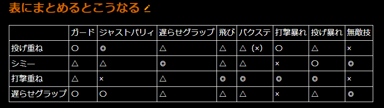

# SF6

- [SF6](#sf6)
  - [起き攻めのまとめ表](#起き攻めのまとめ表)
  - [アケコン修行](#アケコン修行)
  - [練習メモ](#練習メモ)
  - [用語集](#用語集)
  - [チュンリー](#チュンリー)
    - [攻略メモ](#攻略メモ)
      - [ゴジライン](#ゴジライン)
    - [反省点、成長点](#反省点成長点)
    - [コンボレシピ](#コンボレシピ)
      - [表記説明](#表記説明)
      - [基本](#基本)
      - [投げつぶし](#投げつぶし)
      - [リバーサル無敵反撃](#リバーサル無敵反撃)
      - [スタン](#スタン)

## 起き攻めのまとめ表

## アケコン修行
- つまみ持ちとワイン持ちの中間位
- レバーの根っこをもつといいかも（ななめへの誤入力が減らせそう）
  - 236KK キャンセル　236236Kが出し易い
  - 薬指と中指でレバーを挟んで支えて親指と人差し指で半々ずつくらいの力で入力するイメージ
    - 下入力は人差し指担当
    ~~- 肘を締める、手の縦に水平になるように~~
    - 左手はななめに
- 左手薬指の第一関節（爪）が当たらないくらいでレバー下を支える
- 余り力入れない方がいい
- 右手は親指使わないスタイル。掌の下部を白いふちにあてがう

## 練習メモ
- ヒット確認練習方法
  - トレモでガードをランダムに設定して練習
  - ガード時はコンボ数表記に何も表示されないので、そこで止める様意識する。
- 重ね
  - 画面端にして、反撃設定 > ダウンリバーサル > しゃがみ弱P
  - しゃがみ弱Pの暴れに対応したコンボ、投げを練習しておく
- 対空練習
  - CPUレベル７でCPU側のSA0固定
    - こっち側は基本守りで、0距離なったら投げ抜け、飛ばれた時だけ対空、インパクト来たら返してコンボ練習
  - 簡単練習で、スロット456ONにする。
    - スロット7も使ってインパクトを設定したらよき
  > - ちょっと実践向きじゃないかな～
- 差し替えし
- [ウォーミングアップ](https://twitter.com/nice_guySF/status/1689814426617274368?s=20)
  - トレモのダミーキャラをケンにして
  - それぞれの動きをしっかり受けて最大コンボを出せるように
- インパクト返し
  - 返し後のコンボも練習しとこう
  - 簡単練習で練習できる。s
- あっためるには
  - CPUレベル7
  - バトルハブ
## 用語集
- [格ゲー用語](https://sf6wiki.com/?%E7%94%A8%E8%AA%9E%E9%9B%86#je786bab)

## チュンリー

### 攻略メモ
- Cラッシュ
  - 中足
  - 追突
  - コパ
    - エリアル行ける
  - 立ち弱K
    - コパ＞はっけい＞エリアル
    - ラッシュ見てから最速暴れされたらダメだけど、立ち回りからエリアル行けるコンボ
- 暴れつぶしはっけい（4HP）
  - 思ったより攻撃判定が長くつくので、画面端とかに追い詰めたりダウンさせたときに暴れ小技が届かない位距離取って打つのが強い（カウンター付く）
  - 重ねにも使える
- ガード後暴れつぶし（中距離　HPががっつりあたるくらい）
  - 通常技キャンセル（6MP,2MK,2MP） > 構え > dlMK > 弱秘孔拳
  - 考えてみたけど、構え後攻撃って警戒しそうだからずっとガードかも
- 下強P（2HP）
  - 垂直飛び見てから打つとよい
  - 2HP > 214P.LK > 22HK　のコンボがつながる。〆は中スピバでも可
- 弱秘孔拳
  - 秘孔拳と一緒に寄ってって、相手が飛んだところに対空仕込むのあり寄りの有馬記念ta
- 対空
  - 対空無敵がついているから、基本的に天翔脚で
    - 近めとかで早いタイミングの場合は弱天翔でいい。
    - 強は確実に落とせるタイミングの時だけ
- 起き上がりのじゃんけん
  - こっちがダウン取られた場合
    - 無敵技パナシ
      - シミー以外に勝てる
    - 遅らせグラ（しゃがみガード）
      - 原人狩り（垂直ジャンプ攻撃）に負ける
      - それ以外はあいこ
    - 暴れ　小足か立ちコパ
      - 基本的に重ねられていたら負ける。
    - 前ジャン
      - 基本的に重ねられていたら負ける。
      - シミーに勝てる？
    - ガード
      - 投げに負ける

- 低空百裂
  - どこで使うん？
    - 起き攻めで受けがジャンプしたときの回答、らしい
- 起き攻め
  - 中スピバ〆
    - 前ステ＞微歩き＞投げ(後ろ受け身でも可)
    - 中段
      - DR＞水連掌（3HP）
      - > 無敵、DI以外に勝てる
      - ヒット時（＋７or8）
        - > 弱スピバ〆からの起き攻めだと7になるっぽい。根本あたりだと5(多分最低値)
        - 5の場合
          - 
        - 7の場合（弱スピバから）
          - 微歩き>立ち中しゃが中スピバ(微歩きしないと立ち中が入らん)
          - 
        - 8の場合（中スピバから）
          - はっけい＞構え弱K＞なんでも(スピバ〆)
      - ガード時（＋５）
        - 投げ間合いからすこしずれるため、ちょい歩きが必要
        - 立ち弱Por追突拳（立ち弱は微歩きしないと水連掌が先っちょ当たりの場合ヒットしない）
          - ガード継続されてても距離取れるし、DIにも対応できるので固い
        - 下中K
          - 有利を使って2Fでだせる
          - 中＞下なので強い
          - ヒット確認＞中スピバ
    - 下段
      - 前ステ＞DR>下中K or 下小足 で重なる
      - 
  - コパ３＞OD百裂＞百裂連脚  後ろ受け身したとき
    - DR>投げ
    - 前ステ>2HPで相手の小技暴れをカウンターできる(構え中Kが入る)
      - 相手ガードだと-3F
    - 強はざんが重なる
    - 前ステ＞微歩き>下中K
    - 前飛び
      - 対空に処される
- 画面端強天翔の後
  - 構え大P（中段）が重なる　
    - 相手目線ガード、パリィ、無敵の三択
    - ガード、パリィには構え解除からの投げが有効（重なる）
    - 無敵多いなら構え解除からガード
- インパクト後
  - [スピバ〆置き攻めルート](#コンボレシピ)
    -  HK > 214P.MK > (2)8MKorKK(2960)
 - 構え打ち上げ
- ヒット確認
  - 立ち中P＞しゃが中＞中スピバ
    - ガードされたらパリィ取る練習
- 詐欺飛び
  - 構え打ち上げ
    - コンボ
      - ２HPから構えの場合、少し構えコマンド出すの遅らせる必要がある？
      - ジャンプ後＞j2MK（頂点）>j2MK（遅らせ、半分くらいの高さで当てる）>HP＞HP（タゲコン。2回だけタタン、と早めに押す。）
      - > 後のSA先行入力が大分楽になる。SAレバー入力はHP入力後すぐ
    - ジャンプ攻撃を出すのは、基本こっちが画面端に追い込んだときのみ
    - 中央で後ろ受け身の場合、ジャンプ攻撃が届かないので、着地後待機
      - なげ透かし狩り、無敵狩り
#### ゴジライン
- 基本
  - 弱気功拳でじりじり距離詰め。飛んだら対空。中距離戦は5HP or 2HK
  - 中距離より近めでは2MK,4or6MPにキャンセルラッシュ仕込む※ガードされてても
    - 仕込み（キャンセル元の技）がヒットしてれば、5MP > 4HP > 22HK　でいいダメが出る。
    - 仕込みがガード時も、投げや2LP>投げで暴れつぶしができる。
  - 5MPはガードさせて＋１なのでその後の5LPが暴れつぶしができる。5LPがカウンター時は２MPがつながり、確定できる。

- 画面端
  - 相手の起き上がりに合わせて気功拳がＧＯＯＤ
  - 2HP 4HP

- チュンリー講座
https://youtu.be/L7Ezozdb9DE

### 反省点、成長点
- 反省点
  - 最後まであきらめない
  - 強はざん
    - 基本的に待たれてる時には出さない
    - 安定して出せるのは弾見てから
  - 秘孔拳
    - 画面時端や、コンボ時出なければ、近距離で打つのは微妙
  - 相手がどんな行動しているのかをよく見る癖をつけよう
    - どうやって？
      - 対人を沢山やるのがいいと思う
      - 対戦時に意識的でもいいからやってみる
  - なげ
    - すかすことが多い気がする
    - 距離やタイミングをしっかり計ろう
    - 投げ無敵の間隔も学ぼう
  - 大P
    - 近距離で振らない
  - キャンセルラッシュからのコンボ覚えよう
  - ヒット確認
    - 練習する時が来た
  - SA選択
  - SAぶっぱタイミング
    - どうも狙いすぎて変なタイミングで打ってる
  - パリィのタイミング
    - 詰められて投げられそうな距離でパリィするのはｲｸﾅｲ
    - 至近距離は逆にありだと思う
  - コンボでガードされてる時に必殺技や、大、中攻撃はふらない
    - 隙がでかいから飛ばれる
  - 起き攻めのタイミングが分ってない
  - 中足キャンセルはざんしゅう
    - 入ってるとこ見たことないぞ？多分コマンドミス
  - インパクト
    - 画面端で打ちすぎ
  - インパクト返し
  - 追突拳キャンセル
    - 追突拳＞強天昇脚出せるようにしたい ←ムズイから中百裂でok
  - 空投げ
    - 癖になっちゃってる。
    - 基本相手が~~近い距離から前ジャンした時に後ろ飛びで使うのがいいと思う~~画面端から逃れる時に垂直飛びで使うのがいいと思う
  - 飛び
    - もっと減らしていい。
    - 困ったときに飛びに頼ると対空食らう。
    - 隙見て飛ぶ分には良い
    - 端背負ってる時、相手の位置をよく見て飛ぼう
      - ちょっと距離取られてると対空されるよ
  - ジャンプ攻撃
    - 相手が出してきてこっちガードした際、
  - 飛び道具対応
    - ガードするのはいいけど、詰められて投げとかに移行されると辛いから、そういう時は前ジャンしてめくるのあり
  - 画面端
    - 守り
      - 自分が端背負った時てんぱり過ぎてボタン連打しちゃってる。
      - おちんつけ
      - 基本ガード、投げ抜けねらいでヨシ
      - 自分が飛んで入れ替える時もしっかりタイミングよく攻撃ボタンでめくりだ
    - 攻め
      - 択をしっかり掛けよう
  - ダウン取った後
    - 前ステで寄ってほぼ100％相手の暴れを食らってる。
    - こういう時こそちょっと距離取って4HP 発勁とか2MP　丹頂拳を使おう
  - OD 百裂脚 > 百裂連脚
    - OD百裂ガードされてるのに出す必要ない。-13Fはやべえ
      > OD百裂ガードは-3Fだから、リバーサルで4F技出されてもガード間に合う
    - これめっちゃ多いから百裂ガードされたらこっちもすぐガード入力しよう
  - 対空意識しすぎて強天昇脚がモレル
    - がまん、、、おちつけ
  - 無敵技（OD天昇脚）のタイミング
    - 無敵が1~7Fまでにしかついてないから、見てから出す方がいい
    - 画面端とかで追い込まれてる時の対空は弱でいい（発生F重視）
    - リバサで出すの癖付けた方いい
  - 対空
    - 練習しよ、、、
    - CPU戦やった方いいかも
  - 対モダン
    - ぶっぱSAに注意
    - ゲージ多いときは危険。近づかなくてもいいかも
  - 暴れ
    - 猛って簡単に振りすぎ
    - めっちゃ課題
    - もちょっと相手のこと見よう
    - **相手のラッシュ攻撃ガード後は相手が有利なので、暴れを振らない**
  - 1113　MDJ戦
    - ヒット確認できなすぎ
    - 暴れしすぎだし、タイミングも悪い、冷静に行こう
    - 投げを無理やり通そうとして、すかしまくってる
    - 遅らせグラ控えた方いいかも
      - やってもいいけど、失敗してめっちゃ弱くなっちゃう
        - これも練習かな
      - ゲージあるなら無敵
      - 飛びも可
    - 中はざんはっコンボなんないよ～
  - キャンセルラッシュ
    - 立ち回りでは基本5ゲージ以上持ってる時だけ使おう
    - CR中P
      - ガード＋５だけど、投げ間合いから外れるので、投げる時微歩きが必要。だけど、相手の最速暴れがカウンターする可能性が非常に高い。
      - ガードされてもコンボ継続で4HPはっけいでいい。４HPがガードされたらとめる（ガード後最速暴れと投げに勝てる。そのままちゅうす）
- 成長したとこ
  - コンボ
  - ガード
    - ジャンプ攻撃をしっかり立ちガードできるようになった
    - 下段も受けれるようになった。
  - 空投げ
    - いい感じに出てるけど、出しどころ注意
    - やっぱ相手が画面端から前ジャンの時がいい
      - 基本その場面だけでいいんじゃないかな
### コンボレシピ

#### 表記説明
- L
  - Light
  - 弱
- M
  - Middle
  - 中
- H
  - Heavy
  - 強
- (c)
  - corner only
  - 画面端
- (nc)
  - not corner
- dl
  - delay
  - 遅らせ
- LP(H)
  - Hold down L Punch button
  - 弱パンチ長押し
- MK(R)
  - 中キックボタンを離す
  - Release M Kick button
- MP(M)
  - Mash H Punch button
  - 強パン連打
- ch
  - counter hit
  - カウンターヒット
  - カウンター時には有利
- pc
  - punish counter
  - パニッシュカウンター
- J
  - Jump
- jc
  - ジャンプキャンセル
> レバー入力はテンキーで表す。

#### 基本
> 【】の中はダメージ数

- 5LP始動
  - 5LP > 5MP > 2MP (2)8MK
    - 密着限定
- 2LK始動
  - 2LK > 2LP > (2)8LK 【1269】
    - (2)は溜め
    - 〆後最速で強はざん入れるとガードで＋１、ヒットで＋８（持続で当たる）
  - 2LK > LP > 22HK【1430】
- JHK始動
  - JHK > MP > 2MP > (2)8MK【2720】
    - ダメージ落ちるけど、236MK（百裂脚）でも可
  - JHK > 4HP > 214P.HK > jcJ2MK > JMP > J236HK【3100】
    - 214Pは行雲流水の構え、からの強Kで打ち上げのち追いかけジャンプ※小文字jcは恐らく追いかけジャンプ？
    -  214P.HK > jcJ2MK > JMP > J236HK【2010】
   -  (c)JHK > 4HP > 236HK > 22HK【3240】
      -  画面端のみ
- HK始動
  - HK > 214P.HK > jcJ2MKx2 > J236HK
  - HK > 214P.MK > (2)8MKorKK
- 4HP始動
  - 4HP > 214P.HK > jcJ2MKx2 > J236HK
    - インパクト返し後のコンボとして使用（ダメ2800位）
    - 〆のJ236HKはしっかり最後の6まで入力してからKボタンを押すように意識する。
- 2HP始動
  - 214P.HK > jcJ2MKx2 > J236HK
  - 214P.LK > (2)8MK
- 3HK
  - 3HK > 2MP > (2)8MK【2360】

- USE OD
  - 2LK > LPx2 > 236KK.KK　【1690】
  - 214KK > 22HK【2160】
  - JHK > MP > 2MP > (2)8KK > 214MK
  - MPMK.66.4HPpc > 214HK > 2MP > (2)8KK > MPMK.66.LP > 236HK > 22HK 【4181】
    - パニッシュカウンター始動
  - JHK > MP > 2MP > (2)8KK > MPMK.66.LP > 236HK > 22HK【3421】

- SA
  - ODスピバ、ODはざんしゅうからであれば全部のSA技が入る
  - 基本
    - (c)JHK > MP > 2MP > (2)8KK > 214MK > 214214P or
    - 2MK > 236KK > 236236K > 9j > dl2MKx2 > 214MK
  - 空中
    - 4HP > 214P.HK > jcJHPx2 > 236236P【3270】
  - ラッシュ絡め
    - 2LP > MP > 2MP > 2(8)KK > MPMK.66.LP > 214P.MK > 66.HP > 214P.MK > 214214P【5000くらい？】
      > Dゲージフル消費;;
      - SA2
      https://youtu.be/SnaHCW90LY0?t=523
- カウンター
  - 236KK > 2LK > (2)8LK
- パニッシュカウンター
  - 236KK > 2MK > 2(8)MK

- 画面端
  - 2HP > 214P.LK > 2(8)KK > 236LK > 22HK
    - 画面端に投げて距離が離れた後にも使える
  - ドライブインパクト始動
    - HKHP > 4HP > 236HK > 22HK or 22KK
    - HKHP > 4HP > 236HK > 236236K > jcJ2MK > JMP > J236HK ?
    - HKHP > 4HP > 236HK > 214214K

- ドライブラッシュ絡め
  - MPMK.66.MP > 2MP > (2)8KK > 236LK > 22HK
  - MPMK.66.3HP > 2MP > (2)8KK > 236LK > 22HK
    - 中段から
  - 後ろ受け身ナシの場合
    - 2MK > 236KK > KK > 
      - MPMK.66.MP > 2MP > (2)8MK
      - MPMK.66.2LK > 2LP > 2LP > (2)8LK
      - MPMK.66.3HP > MP > 2MP > (2)8MK
        - 起き上がり中段だから強そう
  - MP > 2MP > 236KK.KK > MPMK.66.MP > 2MP > (2)8MK

- 暴れ  
  - 2LP > (2)8LK > 66.6（起き攻め）

- キャンセルラッシュ絡め
  - 2MK > 66.MP > 4HP > 214P.LK > (2)8MK

#### 投げつぶし
- 2HP
  - DRゲージ全消費
  - 画面端限定
  - [URL](https://youtu.be/aR7SdgV_oM8?list=PLKjAi9IEWPhqMh9hmYQk8pR8yqxiE733d&t=1447)
    - 2HPpc > 214P.MK > (4)6PP > MP > 2MP > MPMK.66.2HP > 214P.MK > MPMK.66.4HP > 214P.HK > jc9 > J2MK > J2MKdl > HP > HP > 
      - 236236P(4907)
      - 236236K > jc9 > HP > HP(5237)
      - 214214K(6397)

#### リバーサル無敵反撃
- DR4HP
  - > そもそもDR4HPをリバサに当てるのがムズイ（キャラによって無敵技が違うから）
  - しゃがみガード基本
  - ホンダのOD頭突きはパリィじゃないとゲージ足りない。（銀杏との読みあい）
  - DRゲージ全消費
    - DR4HPpc > 214HK > 2MP > DR2HP > 214P.MK > (4)6PP > MP > 2MP > DR2HP > 214P.HK > jc9 > J2MK > J2MKdl > HP > HP > 
      - SA1(5114)
      - SA2 > jc9 > HPHP(5444)
      - SA3(6604)
    - >（端限定だけど、端とド真ん中の間くらいの位置なら強はざんで結構運びできるからおk）
    - ※中央からだとod気功→立ち弱K→cDR立ちコパ→発勁→構え大K…とルートが変わる。ちな端と中央で200位しかダメージ変わんないよ 
  - DR1消費
    - DR4HPpc > 214P.MK > (2)8MK(3480)
- HK(通常食らいがリバサ反撃位しかチャンス無いよね)
  - ダメージはDRはっけいに負けるが、圧倒的に当てやすい（キャラによって距離の差がない）為、実践ではこっち使っていきたい
  - DR2消費
    - HKpc > 214P.MK > (2)8KK
      - 22HK
      - SA(5320)
      - 236LK(c) > 22HK
  - DR4消費(BO)
    - 端限定
      - HKpc > 214P.MK > (4)6PP > MP > 2MP > DR2HP > 214.PMK > DR4HP > 214P.HK > エリアル
        - SA3（6397）
        - DR2HPからそのままエリアルに繋ぐと、DR3で済む(6122)
    - 中央(DR3)
      -  HKpc > 214P.MK > (4)6PP > LK > DRLP > 4HP > 214P.> 214P.HK > エリアル
        - SA3（5663）
      - 火力もあんまないから、基本中央はODスピバのコンボで良さそう

  
- ゲージなし
  - 普通に起き攻め
    - HKpc > 214P.MK > (2)8MK
  - 詐欺とび 簡単
    - 2HP,4HP,5HKから派生可能
    - pc > 214P.HK > jc9 > J2MK > J2MKdl > HP > HP >
      - SA1(3460)
        - めっちゃ距離離れる
      - SA2(3580)
        - 追加の詐欺とび無いから微妙かも
        - 密着起き攻めはできる
      - SA3(4780)
      - 9JHK

#### スタン
- ゲージ3本から可（DIでスタン）
  - 歩き＞~~jHKHPdl >~~ HK > 214P.MK > (4)6PP > MP > 2MP > DR2HP > 214P.HK > jc9 > J2MK > J2MKdl > HP > HP
    - ~~> 頭のjHPは遅らせ必要（14F稼ぐため）~~
    - 5571ダメージ（jHKからでも5706で130位しか変わらんから安定するHKからのルートでいい）
    - SA各種
    - そのまま詐欺飛び

1203 通話
さぎとび後
踏み遅らせ⇒遅らせだいK（+10）
小足ラッシュ
ラッシュ中段⇒端なら中P、中央なら立ちK⇒中百裂
(基本は端にやってる時に中段打つ)
ODはざん⇒しゃが中⇒インパクト（がめんはじ）
だいてんしょう〆⇒立ち中K⇒はっけい⇒インパクト
パニカン無最大
立ち大Ｋ⇒構え中Ｐ⇒キャンセルＸ２⇒
大天翔ご重ね構え中段⇒ODきこう
ガードしててもレンガで±０
ようそう
踏みJ大KかJ中Kめくり

エリアル⇒前ステX2⇒ようそう⇒小足⇒立ちコパ

キャラ対
ケンルークキャミイ
自分がバーンアウト時迅雷こすってくるケンにはコパン連打

入れ替え
背中けり

- 中央パニ無
  - ゲージ全(3でも可)
    - はっけいはっけい  5720

  - ゲージ5(2でも可)
    - ODきこう立ち弱K 5483
> はっけいはっけいの方が少し運ぶ距離がでかい
